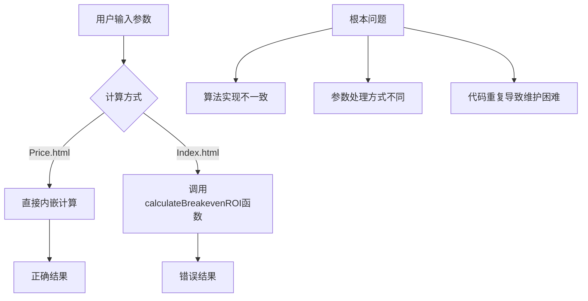

# 数据显示错误修复设计

## 概述

通过对比分析price.html和index.html页面的保本ROI和保本广告占比计算逻辑，发现index.html页面利润计算tab中的数值显示存在错误。

**重要说明：** 经用户确认，price.html电脑端的计算结果是正确的，应作为修复的标准算法。

**修复策略：** 直接修复calculator.js中的`calculateBreakevenROI`函数，该函数是专门用来计算ROI的，修复后所有调用该函数的地方都将受益。

## 问题分析

### 1. 问题定位

**问题现象：**
- price.html页面电脑端的保本ROI和保本广告占比计算结果正确
- index.html页面利润计算tab中的保本ROI和保本广告占比数值错误

**根本原因：**
index.html和price.html电脑端使用了不同的计算逻辑和函数调用方式：

1. **Price.html电脑端使用正确的内嵌计算逻辑**
2. **Index.html调用的calculateBreakevenROI函数存在算法错误**

需要修复calculator.js中的`calculateBreakevenROI`函数，使其与price.html电脑端的正确算法保持一致。

### 2. 计算逻辑差异分析

#### Price.html电脑端的正确算法（直接内嵌计算）

```javascript
// price.html中的计算逻辑 (行1391-1399)
const breakevenAdRate = (effectiveSalesRate / (1 - v/(1 + v))) * term;

let breakevenROI;
if (breakevenAdRate <= 0) {
    breakevenROI = '∞';
} else if (!isFinite(breakevenAdRate) || breakevenAdRate >= 1) {
    breakevenROI = '-';
} else {
    breakevenROI = (effectiveSalesRate / breakevenAdRate).toFixed(2);
}
```

**关键计算参数：**
- `effectiveSalesRate`：有效销售率
- `v = 0.06`：服务业增值税率
- `term = D - (B / sellingPrice)`：中间计算项
- `D = 1 - platformRateDecimal - taxFactorOnFinal + platformVatCredit`
- `B = effectiveCost + fixedCosts`

**此算法已经验证正确，应作为标准算法。**

### 3. 正确的计算公式说明

根据用户提供的正确公式：

#### 保本广告占比计算公式
```
保本广告占比 = (有效销售率 ÷ (1 - 6%)) × (D - B ÷ 含税售价)

其中：
- B = 实际进货成本 - 商品进项税 + 固定成本分摆
- D = 1 - 平台佣金比例 - 销项税占比 + (6% ÷ (1 + 6%)) × 平台佣金比例
```

#### 保本ROI计算公式
```
保本ROI = 有效销售率 ÷ 保本广告占比
```

**数学原理：**
- ROI = 有效GMV ÷ 广告费
- 有效GMV = 含税售价 × 有效销售率
- 广告费 = 含税售价 × 保本广告占比
- 因此：保本ROI = (含税售价 × 有效销售率) ÷ (含税售价 × 保本广告占比) = 有效销售率 ÷ 保本广告占比

#### Index.html中的问题算法（函数调用）

```javascript
// index.html中的计算逻辑 (calculator.js 行715-748)
const roiRes = calculateBreakevenROI({
    costPrice: inputs.costPrice,
    inputTaxRate: inputs.inputTaxRate,
    outputTaxRate: inputs.outputTaxRate,
    salesTaxRate: inputs.salesTaxRate,
    platformRate: inputs.platformRate,
    shippingCost: inputs.shippingCost,
    shippingInsurance: inputs.shippingInsurance,
    otherCost: inputs.otherCost,
    returnRate: inputs.returnRate,
    finalPrice: inputs.actualPrice
});
```

### 3. 具体问题识别

通过分析calculator.js中的`calculateBreakevenROI`函数（行1296-1329），发现问题：

#### 问题1：参数获取和处理方式不一致

**Price.html直接计算方式：**
- 直接从页面输入框获取参数
- 立即进行计算，使用的是当前输入值

**Index.html函数调用方式：**
- 通过`calculateBreakevenROI`函数间接计算
- 可能存在参数传递或转换问题

#### 问题2：算法实现差异

通过对比发现，`calculateBreakevenROI`函数在calculator.js中的实现与price.html中的直接计算逻辑存在细微差异：

**Price.html算法特点：**
```javascript
// 修正：广告费进项税抵扣基于不含税金额计算
const breakevenAdRate = (effectiveSalesRate / (1 - v/(1 + v))) * term;
```

**Calculator.js中的算法：**
```javascript
// 第1296-1329行的实现可能存在与price.html不同的计算逻辑
const breakevenAdRate = E * (baseConstant - K0_ratio) / adTaxFactor;
```

## 技术分析

### 1. 系统架构问题

#### 代码重复问题
- Price.html使用内嵌的保本计算逻辑
- Index.html使用calculator.js中的统一函数
- 两种实现方式导致计算结果不一致

#### 参数口径不统一
- 不同页面可能使用不同的参数获取方式
- 税率、费率等关键参数的处理方式可能存在差异

### 2. 数据流分析



## 修复方案

### 1. 统一计算逻辑

#### 方案A：修复calculateBreakevenROI函数（推荐）
直接修夏calculator.js中的`calculateBreakevenROI`函数，使其实现与price.html电脑端的正确算法一致。

#### 方案B：使用Price.html电脑端的正确算法
将price.html电脑端中已验证正确的计算逻辑提取为统一函数，替换index.html中的错误实现。

### 2. 推荐方案：修复calculateBreakevenROI函数

考虑到`calculateBreakevenROI`是专门用来计算ROI的函数，且在多个地方被调用，建议直接修复该函数：

#### 步骤1：修复calculateBreakevenROI函数算法
根据正确的计算公式修复calculator.js中的`calculateBreakevenROI`函数：

```javascript
/**
 * 计算保本ROI和保本广告占比（修复版）
 * 基于price.html电脑端的正确算法
 */
function calculateBreakevenROI(params) {
    const {
        costPrice,          // 进货价（不含税）
        inputTaxRate,       // 开票成本比例
        outputTaxRate,      // 商品进项税率
        salesTaxRate,       // 销项税率
        platformRate,       // 平台佣金比例
        shippingCost,       // 物流费
        shippingInsurance,  // 运费险
        otherCost,          // 其他成本
        returnRate,         // 退货率
        finalPrice          // 含税售价
    } = params;
    
    try {
        // 1. 计算有效销售率
        const effectiveSalesRate = 1 - returnRate;
        
        // 2. 计算实际进货成本（包含开票成本）
        const effectiveCost = costPrice + (costPrice * inputTaxRate);
        
        // 3. 计算商品进项税
        const purchaseVAT = costPrice * outputTaxRate;
        
        // 4. 计算固定成本分摆
        const fixedCosts = (shippingCost + shippingInsurance + otherCost) / effectiveSalesRate;
        
        // 5. 计算B值：实际进货成本 - 商品进项税 + 固定成本分摆
        const B = effectiveCost - purchaseVAT + fixedCosts;
        
        // 6. 计算销项税占比
        const taxFactorOnFinal = salesTaxRate / (1 + salesTaxRate);
        
        // 7. 计算平台佣金进项税抵扣
        const v = 0.06; // 服务业增值税率
        const platformVatCredit = (platformRate / (1 + v)) * v;
        
        // 8. 计算D值
        const D = 1 - platformRate - taxFactorOnFinal + platformVatCredit;
        
        // 9. 计算中间项term
        const term = D - (B / finalPrice);
        
        // 10. 计算保本广告占比（使用正确公式）
        const breakevenAdRate = (effectiveSalesRate / (1 - v / (1 + v))) * term;
        
        // 11. 计算保本ROI
        let breakevenROI;
        if (breakevenAdRate <= 0) {
            breakevenROI = Infinity;
        } else if (!isFinite(breakevenAdRate) || breakevenAdRate >= 1) {
            breakevenROI = NaN;
        } else {
            breakevenROI = effectiveSalesRate / breakevenAdRate;
        }
        
        return {
            breakevenAdRate,
            breakevenROI,
            feasible: isFinite(breakevenROI) && breakevenROI > 0,
            note: breakevenAdRate <= 0 ? '无需广告也能保本' : 
                  breakevenAdRate >= 1 ? '不现实：需广告占比≥99%' : ''
        };
        
    } catch (error) {
        return {
            breakevenAdRate: NaN,
            breakevenROI: NaN,
            feasible: false,
            note: '计算失败'
        };
    }
}
```

#### 步骤2：验证修复结果
确保修复后的`calculateBreakevenROI`函数与price.html电脑端的计算结果一致：

```javascript
// 在index.html中测试修复后的函数
const testParams = {
    costPrice: 38,
    inputTaxRate: 0.06,      // 6%
    outputTaxRate: 0.13,     // 13%
    salesTaxRate: 0.13,      // 13%
    platformRate: 0.055,     // 5.5%
    shippingCost: 2.8,
    shippingInsurance: 1.5,
    otherCost: 2.5,
    returnRate: 0.20,        // 20%
    finalPrice: 79
};

const result = calculateBreakevenROI(testParams);
console.log('修复后的计算结果：', result);

// 对比price.html电脑端的结果
// 确保两者一致
```

### 3. 验证方案

#### 单元测试
创建测试用例，使用相同参数在两个页面中进行计算，确保结果一致（以price.html电脑端为正确标准）：

```javascript
function validateConsistency() {
    const testParams = {
        costPrice: 38,
        invoiceCost: 6,
        sellingPrice: 79,
        marketingCost: 30,
        riskRate: 20,
        inputTaxRate: 6,
        outputTaxRate: 13,
        platformFee: 5.5,
        logisticsCost: 2.8,
        shippingInsurance: 1.5,
        otherCost: 2.5
    };
    
    // 对比两种计算方式的结果（以price.html电脑端为正确标准）
    const priceHtmlDesktopResult = calculateFromPriceHtmlDesktop(testParams);
    const indexHtmlResult = calculateFromIndexHtml(testParams);
    
    console.assert(
        Math.abs(priceHtmlDesktopResult.breakevenROI - indexHtmlResult.breakevenROI) < 0.01,
        '保本ROI计算结果与price.html电脑端不一致'
    );
    console.assert(
        Math.abs(priceHtmlDesktopResult.breakevenAdRate - indexHtmlResult.breakevenAdRate) < 0.0001,
        '保本广告占比计算结果与price.html电脑端不一致'
    );
}
```

## 实施计划

### 阶段1：问题确认（1天）
1. 使用相同测试数据在两个页面中验证计算差异（以price.html电脑端为正确标准）
2. 详细记录差异数据和具体偏差值
3. 分析差异的数学原因

### 阶段2：修复calculateBreakevenROI函数（2天）
1. 根据正确公式修复calculator.js中的`calculateBreakevenROI`函数
2. 确保算法实现与price.html电脑端完全一致
3. 保持函数接口不变，仅修复内部算法

### 阶段3：测试验证（1天）
1. 创建自动化测试用例验证修复后的`calculateBreakevenROI`函数
2. 验证修复后的计算结果与price.html电脑端一致性
3. 进行回归测试确保不影响其他功能

### 阶段4：代码清理（1天）
1. 移除重复的计算逻辑
2. 统一参数命名和处理方式
3. 更新相关文档

## 风险控制

### 技术风险
- **向后兼容性**：保持`calculateBreakevenROI`函数接口不变，仅修复内部算法
- **精度问题**：保证数值计算的精度一致性
- **参数映射**：确保参数在修复后的函数中正确处理
- **多处调用**：确保所有调用`calculateBreakevenROI`的地方都受益于修复

### 业务风险
- **用户体验**：避免修复过程中出现计算错误
- **数据一致性**：确保所有页面显示结果一致

## 质量保证

### 测试策略
1. **单元测试**：验证单个函数的计算准确性
2. **集成测试**：验证不同页面间的数据一致性
3. **用户验收测试**：使用真实业务数据验证修复效果

### 监控方案
1. 在关键计算点添加日志输出
2. 建立计算结果的自动对比机制
3. 监控用户反馈和错误报告

## 长期优化建议

### 1. 代码架构优化
- 建立统一的计算引擎
- 消除重复的算法实现
- 建立标准的参数验证机制

### 2. 维护体系完善
- 建立算法变更的版本控制
- 完善自动化测试覆盖
- 建立算法准确性的持续监控

### 3. 文档和规范
- 完善算法文档和公式推导
- 建立代码评审和算法验证流程
- 制定数值计算的编码规范