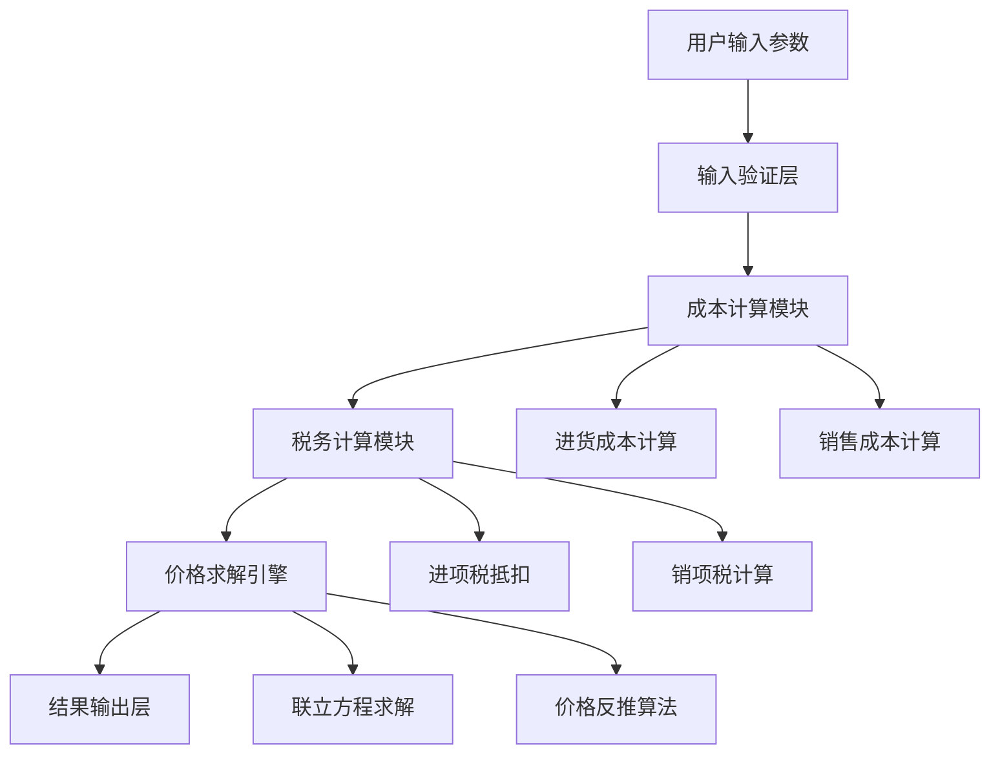

# 售价计算函数搜索与分析设计文档

## 概述

本文档分析了 pricecalculator 系统中与售价计算相关的核心函数，这些函数负责根据已知参数计算合理的销售价格或进行价格推演。系统采用复杂的数学模型，综合考虑进货成本、税务抵扣、平台佣金、退货率等多个因素。

## 系统架构概览

### 计算引擎架构


## 核心售价计算函数分析

### 1. 主售价计算函数 - `calculate()`

**位置**: `/js/calculator.js:L1504-L1570`

**功能概述**: 
售价计算功能的主入口函数，协调整个售价计算流程，基于目标利润率和各项成本参数计算出建议的含税售价。

**核心算法逻辑**:
``mermaid
sequenceDiagram
    participant U as 用户
    participant C as calculate()
    participant PC as calculatePurchaseCost()
    participant SC as calculateSalesCost()
    participant P as calculatePrices()
    
    U->>C: 输入进货价、利润率等参数
    C->>C: 验证参数组合可行性
    C->>PC: 计算进货成本
    PC-->>C: 返回进货成本结构
    C->>SC: 计算销售成本
    SC-->>C: 返回销售成本结构
    C->>P: 计算最终价格
    P-->>C: 返回定价结果
    C->>U: 显示建议售价
```

**关键特性**:
- 支持实时计算和参数验证
- 考虑退货率对成本的分摊影响
- 集成税务合规计算
- 提供保本ROI分析

### 2. 最终价格计算 - `calculatePrices()`

**位置**: `/js/calculator.js:L1097-L1179`

**功能概述**:
核心价格计算引擎，使用基于利润线性函数的倒推公式求解最终含税售价。该算法通过构建利润关于售价的线性关系，精确计算出满足目标利润率的最优定价。

**正确的数学推导**:

1. **利润线性函数**:
   ```
   profit(P) = A × P - K₀
   
   其中：
   - A: 每元售价的净贡献系数
   - K₀: 与售价无关的净成本常数
   ```

2. **系数A的计算**:
   ```
   A = 1 - α - β/E - t/(1+t) + v/(1+v)(α+β)
   
   组成部分：
   - 1: 基础售价（100%）
   - α: 平台佣金占比（减项）
   - β/E: 广告费分摊占比（减项）
   - t/(1+t): 销项税占比（减项）
   - v/(1+v)(α+β): 服务业进项税抵扣（加项）
   ```

3. **常数K₀的计算**:
   ```
   K₀ = C_goods + C_fix - VAT_in,goods
   
   组成部分：
   - C_goods: 进货净成本 = costPrice × (1 + inputTaxRate)
   - C_fix: 固定成本分摊 = (shipping + insurance + other) / E
   - VAT_in,goods: 商品进项税抵扣 = costPrice × outputTaxRate
   ```

4. **售价求解**:
   ```
   目标: m × P = A × P - K₀
   
   解得: P = K₀ / (A - m)
   
   可行性条件: A - m > 0
   ```

**正确的数学模型**:

基于利润线性函数的倒推公式：
```
profit(P) = A · P - K₀

其中：
A = 1 - α - β/E - t/(1+t) + v/(1+v)(α+β)
K₀ = C_goods + C_fix - VAT_in,goods

最终售价：P = K₀ / (A - m)
```

**变量定义**：
- E = 1 - returnRate (有效率)
- C_goods = costPrice × (1 + inputTaxRate) (进货净成本)
- C_fix = (shippingCost + shippingInsurance + otherCost) / E (固定成本摊到有效单)
- VAT_in,goods = costPrice × outputTaxRate (商品进项税额)
- α = platformRate (平台佣金率)
- β = adRate (广告费率)
- t = salesTaxRate (销项税率)
- v = 0.06 (服务业税率)
- m = targetProfitRate (目标利润率)

**修正后的核心计算要素**:

| 要素 | 计算方式 | 说明 |
|------|----------|------|
| 有效率 E | `1 - returnRate` | 扣除退货后的有效销售率 |
| 进货净成本 | `costPrice × (1 + inputTaxRate)` | 包含开票成本的实际进货成本 |
| 固定成本分摊 | `(shipping + insurance + other) / E` | 不可退回成本按有效率分摊 |
| 系数A | `1 - α - β/E - t/(1+t) + v/(1+v)(α+β)` | 每元售价的净贡献系数 |
| 常数K₀ | `C_goods + C_fix - VAT_in,goods` | 净成本减去可抵扣商品进项税 |
| 可行性条件 | `A - m > 0` | 确保分母大于零，有唯一解 |

### 3. 进货成本计算 - `calculatePurchaseCost()`

**位置**: `/js/calculator.js:L976-L1000`

**功能概述**:
计算与商品采购相关的成本结构，包括进货价、开票成本和可抵扣进项税。

**计算结构**:
```javascript
{
    costPrice: 进货价（不含税）,
    invoiceCost: 开票费用 = 进货价 × 开票成本率,
    totalPurchaseCost: 实际支付总金额,
    purchaseVAT: 可抵扣商品进项税,
    effectiveCost: 实际成本
}
```

### 4. 销售成本计算 - `calculateSalesCost()`

**位置**: `/js/calculator.js:L1055-L1096`

**功能概述**:
计算销售环节的各项成本，考虑退货率影响，计算成本分摊和税务抵扣。

**关键特性**:
- 退货率分摊：不可退回成本按 `1/(1-退货率)` 分摊
- 进项税抵扣：广告费和平台佣金可获得6%进项税抵扣
- 成本分类：区分可退回和不可退回成本

## 价格推演与反推功能

### 1. 标价计算 - `calculateListPrice()`

**位置**: `/price.html:L2088-L2224`

**功能概述**:
基于目标到手价，考虑立减和满减优惠，反推计算需要设定的标价。

**算法特点**:
- 使用精度安全算法，避免浮点数误差
- 支持复合优惠：立减 + 满减的叠加计算
- 穷举验证：确保计算结果的自洽性

**核心逻辑**:
``mermaid
flowchart TD
    A[目标到手价] --> B[穷举优惠组合]
    B --> C[反推理论标价]
    C --> D[精度验证]
    D --> E{自洽检验}
    E -->|通过| F[输出建议标价]
    E -->|失败| G[尝试下一组合]
    G --> C
```

### 2. 成本价反推 - `calculateCostPriceByClosedForm()`

**位置**: `/js/calculator.js:L10647-L10710`

**功能概述**:
基于目标到手价和业务参数，使用闭式解法反推计算所需的进货成本。

**数学推导**:
采用联立方程的逆向求解，通过代数变换得到进货成本的闭式解：
```
C = (P × D - F_eff) / kC
```
其中：
- P: 目标到手价
- D: 分母系数
- F_eff: 分摊后固定成本
- kC: 成本线性系数

## 保本分析功能

### 1. 保本ROI计算 - `calculateBreakevenROI()`

**位置**: `/js/calculator.js:L1190-L1270`

**功能概述**:
计算在利润为零时所需的最低ROI（投入产出比），为广告投放决策提供科学依据。

**核心指标**:
- **保本广告占比**: 实现盈亏平衡所需的广告费占售价比例
- **保本ROI**: GMV除以广告费的最低比值
- **可行性评估**: 判断参数组合的商业可行性

**计算公式**:
```
保本广告占比 = (有效销售率 / 进项税净占比) × (分母常数 - 成本占比)
保本ROI = 有效销售率 / 保本广告占比
```

### 2. 数值分析 - `calculateNumericalAnalysis()`

**位置**: `/js/calculator.js:L1290-L1420`

**功能概述**:
基于转化率的深度分析，建立"CPC ↔ CVR ↔ 售价"的三角关系模型。

**分析维度**:
- **临界CPC**: 给定转化率下的最高可承受点击成本
- **临界CVR**: 给定CPC下的最低转化率要求
- **临界售价**: 给定推广成本下的最低销售价格

## 税务合规机制

### 进项税抵扣修正

**问题背景**:
系统早期存在进项税抵扣计算错误，使用了"价内税"方式计算抵扣，在概念上是混淆的。

**修正方案**:
```
// 错误的计算方式
const wrongVATCredit = amount * (VAT_RATE / (1 + VAT_RATE));

// 正确的计算方式
const correctVATCredit = (amount / (1 + VAT_RATE)) * VAT_RATE;
```

**修正影响的函数**:
- `calculatePrices()`: 广告费和平台佣金进项税抵扣
- `calculateBreakevenROI()`: 保本分析中的税务处理
- `calculate()`: 主计算流程中的抵扣因子

### 税务计算规则

| 税务项目 | 计算基准 | 税率 | 抵扣方式 |
|----------|----------|------|----------|
| 商品进项税 | 进货价（不含税） | 13% | 直接抵扣 |
| 销项税 | 售价净额 | 13% | 价内税 |
| 广告费进项税 | 广告费（不含税） | 6% | 服务业抵扣 |
| 平台佣金进项税 | 佣金（不含税） | 6% | 服务业抵扣 |

## 精度安全机制

### 浮点数处理

为避免JavaScript浮点数计算误差，系统采用以下策略：

1. **分厘精度**: 使用"分"和"厘"作为计算单位
2. **字符串转换**: 避免二进制浮点数误差
3. **向下取整**: 在临界计算中采用保守策略

**核心工具函数**:
```
// 元转分（整数）
function yuanToCents(yuan)

// 分转元（保留2位小数）
function centsToYuan(cents)

// 精度安全的分数乘法
function mulCentsByFractionToMils(priceCents, num, den)
```

### 边界条件处理

| 边界情况 | 处理策略 | 示例 |
|----------|----------|------|
| 分母为零 | 抛出错误提示 | 参数组合过高导致无解 |
| 负数结果 | 返回NaN或提示 | 成本超过售价的情况 |
| 无穷大ROI | 特殊标记 | 无需广告即可保本 |
| 精度临界 | 向下取整 | 满减触发条件判断 |

## 用户交互与验证

### 实时计算机制

系统支持输入参数变化时的实时计算：

```
// 为所有输入框添加实时计算
input.addEventListener('input', () => {
    const tabActive = document.getElementById('priceTab').classList.contains('active');
    if (tabActive) {
        calculate(); // 触发售价计算
    }
});
```

### 参数验证规则

| 参数类型 | 验证规则 | 错误处理 |
|----------|----------|----------|
| 进货价 | > 0 | 显示错误提示 |
| 利润率 | 0-100% | 自动限制范围 |
| 退货率 | 0-99.99% | 防止除零错误 |
| 税率 | 0-100% | 合理性检查 |

### 结果展示模板

使用动态HTML生成展示售价计算结果：

```
function generatePriceResultHtml({ purchaseCost, salesCost, priceInfo, inputs }) {
    return `
        <div class="final-price">
            <div class="price-value">¥ ${priceInfo.finalPrice.toFixed(2)}</div>
            <div class="price-hint">此价格已考虑所有成本、税费和目标利润</div>
        </div>
    `;
}
```

## 扩展功能模块

### 1. 批量价格计算

**应用场景**: 商品目录的批量定价分析

**实现方式**: 
- 循环调用核心计算函数
- 支持CSV导入/导出
- 提供统计分析功能

### 2. 价格敏感性分析

**功能描述**: 分析关键参数变化对最终售价的影响

**分析维度**:
- 进货价变化的价格弹性
- 利润率调整的价格影响
- 广告费占比的ROI变化

### 3. 多平台适配

**设计考虑**: 不同电商平台的佣金率和规则差异

**实现策略**:
- 平台参数配置化
- 规则引擎支持
- 结果对比分析

## 当前实现问题分析

### 现有算法的错误

**错误的分子分母结构**:
当前 `calculatePrices()` 函数使用的联立方程方法在数学逻辑上存在缺陷：

```javascript
// 错误的实现方式
const numeratorFinal = purchaseCost.effectiveCost + fixedCosts;
const denominatorFinal = 1 - inputs.platformRate - taxFactorOnFinal 
                       - inputs.targetProfitRate - adFactorEffective 
                       + adVatCreditFactor + platformVatCreditFactor;
const finalPrice = numeratorFinal / denominatorFinal;
```

**主要问题**:
1. **税务处理错误**: 将销项税作为"占比"处理，但实际应该在利润函数中正确建模
2. **成本归类混乱**: 没有正确区分固定成本和变动成本的处理方式
3. **进项税抵扣位置错误**: 应该在K₀常数中减去，而不是在分母中加回
4. **数学模型不清晰**: 缺乏明确的利润函数定义和推导过程

### 正确算法的数学基础

**利润函数建模**:
```
profit(P) = 收入项 - 成本项
         = P - αP - (βP/E) - t/(1+t)×P - (C_goods + C_fix) + VAT抵扣
         = [1 - α - β/E - t/(1+t) + v/(1+v)(α+β)]×P - [C_goods + C_fix - VAT_in,goods]
         = A×P - K₀
```

**关键差异对比**:

| 计算要素 | 错误方法 | 正确方法 | 说明 |
|----------|----------|----------|------|
| 销项税处理 | `t/(1+t)` 作为分母减项 | `t/(1+t)` 作为系数A减项 | 销项税应在利润函数中建模 |
| 进项税抵扣 | 分母加项 | K₀减项 | 商品进项税应直接减少净成本 |
| 成本结构 | 分子为总成本 | K₀为净成本减抵扣 | 更清晰的成本-收益对应关系 |
| 求解方式 | 直接分式计算 | 线性方程求解 | 数学逻辑更严谨 |

### 算法修复建议

**推荐的实现方式**:
```
function calculatePricesCorrect(inputs) {
    // 1. 计算基础参数
    const E = 1 - inputs.returnRate;
    const C_goods = inputs.costPrice * (1 + inputs.inputTaxRate);
    const C_fix = (inputs.shippingCost + inputs.shippingInsurance + inputs.otherCost) / E;
    const VAT_in_goods = inputs.costPrice * inputs.outputTaxRate;
    
    // 2. 计算系数A
    const α = inputs.platformRate;
    const β = inputs.adRate;
    const t = inputs.salesTaxRate;
    const v = 0.06;
    const A = 1 - α - β/E - t/(1+t) + v/(1+v)*(α+β);
    
    // 3. 计算常数K₀
    const K0 = C_goods + C_fix - VAT_in_goods;
    
    // 4. 验证可行性并求解
    const m = inputs.targetProfitRate;
    if (A - m <= 0) {
        throw new Error('参数组合导致无解，需要调整目标利润率或其他参数');
    }
    
    const finalPrice = K0 / (A - m);
    return { finalPrice, A, K0, feasible: true };
}
```

### 修复后的完整代码实现

#### 1. 修复 calculatePrices() 函数

```javascript
/**
 * 计算最终价格和相关费用 - 使用正确的利润线性函数模型
 * 
 * 基于正确的数学推导：profit(P) = A×P - K₀
 * 其中：
 * A = 1 - α - β/E - t/(1+t) + v/(1+v)(α+β)
 * K₀ = C_goods + C_fix - VAT_in,goods
 * 
 * @param {Object} purchaseCost 进货成本结构
 * @param {Object} salesCost 销售成本结构 
 * @param {Object} inputs 输入参数
 * @returns {Object} 计算结果
 */
function calculatePrices(purchaseCost, salesCost, inputs) {
    // 1. 定义中间量（使用正确的字段映射）
    const E = salesCost.effectiveRate; // 有效率 = 1 - returnRate
    const C_goods = purchaseCost.effectiveCost; // 进货净成本 = costPrice × (1 + inputTaxRate)
    const C_fix = (inputs.shippingCost + inputs.shippingInsurance + inputs.otherCost) / E; // 固定成本摊到有效单
    const VAT_in_goods = purchaseCost.purchaseVAT; // 商品进项税额（可抵扣）
    
    // 2. 定义系数和税率
    const α = inputs.platformRate; // 平台佣金率
    const β = inputs.adRate; // 广告费率
    const t = inputs.salesTaxRate; // 销项税率
    const v = 0.06; // 服务业税率（广告/平台，可抵扣）
    const m = inputs.targetProfitRate; // 目标利润率
    
    // 3. 计算系数A（每一元售价能留下的净贡献）
    const A = 1 - α - β/E - t/(1+t) + v/(1+v)*(α+β);
    
    // 4. 计算常数K₀（净成本减去可抵扣的商品进项税额）
    const K0 = C_goods + C_fix - VAT_in_goods;
    
    // 5. 验证可行性条件
    if (A - m <= 0) {
        throw new Error(`参数组合导致无解：A-m = ${(A-m).toFixed(4)} ≤ 0。请降低目标利润率或调整其他参数。`);
    }
    
    // 6. 计算最终含税售价
    const finalPrice = K0 / (A - m);
    
    // 7. 基于最终售价计算各项费用
    const netPrice = finalPrice / (1 + t); // 不含税净价
    const platformFee = finalPrice * α; // 平台佣金
    const adCost = finalPrice * β; // 广告费
    const outputVAT = netPrice * t; // 销项税
    
    // 8. 计算进项税抵扣明细
    // 广告费进项税抵扣（基于不含税金额）
    const adCostEffective = adCost / E; // 分摊后广告费
    const adCostNet = adCostEffective / (1 + v); // 不含税广告费
    const adVAT = adCostNet * v; // 广告费进项税抵扣
    
    // 平台佣金进项税抵扣（基于不含税金额）
    const platformFeeNet = platformFee / (1 + v); // 不含税平台佣金
    const platformVAT = platformFeeNet * v; // 平台佣金进项税抵扣
    
    // 总可抵扣进项税
    const totalVATDeduction = VAT_in_goods + adVAT + platformVAT;
    
    // 实际应缴增值税
    const actualVAT = outputVAT - totalVATDeduction;
    
    // 9. 验证利润计算（用于调试）
    const totalCost = C_goods + platformFee + adCostEffective + C_fix + actualVAT;
    const profit = finalPrice - totalCost;
    const calculatedProfitRate = profit / finalPrice;
    
    // 10. 计算展示用的成本结构
    const fixedCosts = C_fix;
    const effectiveNonReturnableCost = adCostEffective + C_fix;
    const effectiveCostTotal = C_goods + effectiveNonReturnableCost;
    
    return {
        // 核心价格信息
        finalPrice,
        netPrice,
        
        // 费用明细
        platformFee,
        adCost,
        outputVAT,
        actualVAT,
        
        // 利润信息
        profit,
        profitRate: (calculatedProfitRate * 100).toFixed(2),
        
        // 税务明细
        adVAT,
        platformVAT,
        totalVATDeduction,
        
        // 成本结构（用于展示）
        fixedCosts,
        effectiveNonReturnableCost,
        effectiveCostTotal,
        
        // 中间计算量（用于调试和验证）
        coefficientA: A,
        constantK0: K0,
        feasibilityCheck: A - m,
        
        // 保持兼容性的字段
        taxFactorOnFinal: t/(1+t),
        adFactorEffective: β/E,
        adVatCreditFactor: v/(1+v)*β/E,
        profitFactorEffective: m,
        platformVatCreditFactor: v/(1+v)*α
    };
}
```

#### 2. 修复 calculate() 主函数

```javascript
/**
 * 售价计算主函数 - 使用修正后的算法
 */
function calculate() {
    document.getElementById("result").innerHTML = "";
    try {
        // 1. 获取并验证所有输入值
        const inputs = getValidatedInputs();
        
        // 2. 使用正确的可行性验证
        const E = 1 - inputs.returnRate;
        const α = inputs.platformRate;
        const β = inputs.adRate;
        const t = inputs.salesTaxRate;
        const v = 0.06;
        const m = inputs.targetProfitRate;
        
        // 计算系数A
        const A = 1 - α - β/E - t/(1+t) + v/(1+v)*(α+β);
        
        // 验证可行性条件
        if (A - m <= 0) {
            throw new Error(`参数组合导致无解：系数A=${A.toFixed(4)}, 目标利润率=${m.toFixed(4)}, A-m=${(A-m).toFixed(4)} ≤ 0。请降低目标利润率或调整其他参数。`);
        }
        
        // 3. 计算进货成本
        const purchaseCost = calculatePurchaseCost(inputs);
        
        // 4. 计算销售成本
        const salesCost = calculateSalesCost(inputs, 0, purchaseCost);
        
        // 5. 使用修正后的价格计算
        const priceInfo = calculatePrices(purchaseCost, salesCost, inputs);

        // 调试输出
        debugCalculation('price-corrected', {
            inputs,
            purchase: purchaseCost,
            salesCost,
            priceInfo,
            algorithm: {
                coefficientA: priceInfo.coefficientA,
                constantK0: priceInfo.constantK0,
                feasibilityCheck: priceInfo.feasibilityCheck
            }
        });

        // 6. 显示结果
        document.getElementById("result").innerHTML = generatePriceResultHtml({
            purchaseCost,
            salesCost,
            priceInfo,
            inputs
        });
        
    } catch (error) {
        document.getElementById("result").innerHTML = `
            <div class="error">${error.message}</div>
        `;
    }
}
```

#### 3. 修复 calculateBreakevenROI() 函数

```javascript
/**
 * 计算保本ROI - 使用正确的数学模型
 * 
 * @param {Object} params 参数对象
 * @returns {Object} 保本分析结果
 */
function calculateBreakevenROI(params) {
    try {
        // 1. 参数读取和验证
        const costPrice = Number(params.costPrice) || 0;
        const inputTaxRate = Math.max(0, Number(params.inputTaxRate) || 0);
        const outputTaxRate = Math.max(0, Number(params.outputTaxRate) || 0);
        const salesTaxRate = Math.max(0, Number(params.salesTaxRate) || 0);
        const platformRate = Math.max(0, Number(params.platformRate) || 0);
        const shippingCost = Math.max(0, Number(params.shippingCost) || 0);
        const shippingInsurance = Math.max(0, Number(params.shippingInsurance) || 0);
        const otherCost = Math.max(0, Number(params.otherCost) || 0);
        const returnRate = Math.min(0.9999, Math.max(0, Number(params.returnRate) || 0));
        const finalPrice = Number(params.finalPrice) || 0;

        if (finalPrice <= 0) {
            return { breakevenAdRate: NaN, breakevenROI: NaN, feasible: false, note: '售价无效' };
        }

        // 2. 计算关键中间量（使用正确的公式）
        const E = 1 - returnRate;
        const C_goods = costPrice * (1 + inputTaxRate);
        const C_fix = (shippingCost + shippingInsurance + otherCost) / E;
        const VAT_in_goods = costPrice * outputTaxRate;
        const K0 = C_goods + C_fix - VAT_in_goods;
        
        const α = platformRate;
        const t = salesTaxRate;
        const v = 0.06;
        
        // 不含广告费的系数A0
        const A0 = 1 - α - t/(1+t) + v/(1+v)*α;
        
        // 3. 保本条件：利润 = 0
        // 0 = A×P - K₀
        // A×P = K₀
        // (A0 - β/E + v/(1+v)*β/E)×P = K₀
        // 求解保本广告费率 β
        const term1 = K0 / finalPrice; // K₀/P
        const term2 = A0; // 不含广告费的系数
        const coeffBeta = -1/E + v/(1+v)/E; // β的系数
        
        const breakevenAdRate = (term1 - term2) / coeffBeta;
        
        // 4. 计算ROI
        let breakevenROI, feasible = true, note = '';
        
        if (breakevenAdRate <= 0) {
            breakevenROI = Infinity;
            note = '无需广告也能保本';
        } else if (!isFinite(breakevenAdRate)) {
            breakevenROI = NaN;
            feasible = false;
            note = '参数异常';
        } else {
            breakevenROI = E / breakevenAdRate;
            if (breakevenAdRate >= 1) {
                note = '不现实：需广告占比≥100%';
                feasible = false;
            }
        }

        return { breakevenAdRate, breakevenROI, feasible, note };
    } catch (e) {
        return { breakevenAdRate: NaN, breakevenROI: NaN, feasible: false, note: '计算失败' };
    }
}
```

### 验证与测试建议

**测试用例设计**:
- 基准案例：标准参数下的价格计算
- 边界案例：极端参数组合的可行性验证
- 对比验证：新旧算法结果的数值差异分析
- 业务场景：真实电商案例的准确性验证

## 算法验证和测试方案

### 创建验证测试页面

按照系统规范，需要创建专门的测试页面验证修复后的算法正确性。

#### 测试页面设计方案

**文件名**: `price-algorithm-verification.html`

**测试内容**:

1. **对比测试**:
   - 同一参数下旧算法和新算法的结果对比
   - 显示两种算法的中间计算过程
   - 高亮关键差异点

2. **边界测试**:
   - 极端参数组合的可行性验证
   - A - m ≈ 0 的临界情况测试
   - 高退货率、高广告费率的极限情况

3. **精度验证**:
   - 测试数值计算的精度和稳定性
   - 验证利润率的计算精度
   - 检查系数A和常数K₀的正确性

4. **业务场景验证**:
   - 使用真实电商案例数据
   - 验证在常见业务参数下的计算准确性
   - 对比与手工计算的结果

### 测试用例设计

#### 基准测试用例

```javascript
// 标准电商场景参数
const testCase1 = {
    costPrice: 58,           // 进货价
    inputTaxRate: 0.06,      // 开票成本6%
    outputTaxRate: 0.13,     // 商品进项税13%
    salesTaxRate: 0.13,      // 销项税13%
    platformRate: 0.05,      // 平台佣金5%
    adRate: 0.30,            // 广告费30%
    returnRate: 0.10,        // 退货率10%
    targetProfitRate: 0.08,  // 目标利润率8%
    shippingCost: 8,         // 物流费8元
    shippingInsurance: 2,    // 运费险2元
    otherCost: 3             // 其他成本3元
};

// 预期结果（使用正确算法手工计算）
const expectedResult1 = {
    finalPrice: 109.23,      // 预期售价
    profitRate: 8.00,        // 预期利润率
    feasible: true           // 可行性
};
```

#### 极端测试用例

```javascript
// 不可行参数组合
const testCase2 = {
    costPrice: 100,
    inputTaxRate: 0.06,
    outputTaxRate: 0.13,
    salesTaxRate: 0.13,
    platformRate: 0.15,      // 高平台佣金
    adRate: 0.50,            // 高广告费
    returnRate: 0.30,        // 高退货率
    targetProfitRate: 0.20,  // 高目标利润率
    shippingCost: 15,
    shippingInsurance: 5,
    otherCost: 8
};

// 预期结果
const expectedResult2 = {
    feasible: false,         // 应该不可行
    errorMessage: '参数组合导致无解'
};
```

### 验证步骤

1. **部署新算法**: 在测试环境中实现修正后的算法

2. **对比测试**: 运行所有测试用例，对比结果

3. **精度检查**: 验证数值计算的精度和一致性

4. **性能测试**: 确保新算法的计算效率

5. **回归测试**: 确保修改不影响其他功能模块

### 预期改进效果

**计算准确性提升**:
- 消除数学逻辑错误，提高定价精度
- 正确处理税务抵扣，确保税务合规
- 明确可行性条件，避免无意义的计算结果

**系统稳定性提升**:
- 减少计算异常和错误情况
- 提供明确的错误信息和解决建议
- 增强边界情况的处理能力

**代码可维护性提升**:
- 清晰的数学模型和变量定义
- 丰富的代码注释和文档说明
- 模块化的设计，便于后续维护和扩展
