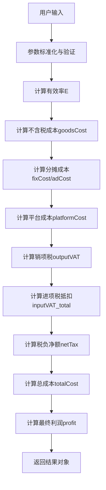

# 利润计算算法修复设计文档

## 1. 概述

### 问题背景
用户提供的正确利润计算算法与系统当前实现存在显著差异，主要体现在：
- 进货成本口径处理不一致
- 税费计算逻辑混乱
- 成本分摊机制不规范
- 变量命名与实际含义不符

### 修复目标
- 统一采用系统参数字段对照表的标准字段名
- 实现与提供的正确算法完全一致的计算逻辑
- 确保所有相关模块的计算结果一致性
- 提高代码可读性和维护性

## 2. 现状分析

### 2.1 当前系统问题

#### 关键问题1：进货成本口径混乱
```javascript
// 当前系统：包含开票成本的"实际成本"
const invoiceCost = costPrice * inputTaxRate;
const totalPurchaseCost = costPrice + invoiceCost;
const effectiveCost = totalPurchaseCost; // 实际是含税成本

// 正确算法：明确区分不含税进价和实际支出
const goodsCost = costPrice * (1 + inputTaxRate); // 进货净成本（不再减进项税）
```

#### 关键问题2：进项税重复抵扣
```javascript
// 当前系统：在effectiveCost中已包含开票成本，又在税费中抵扣purchaseVAT
const purchaseVAT = costPrice * outputTaxRate;
const totalVATDeduction = purchaseVAT + adVAT + platformVAT;

// 正确算法：进项税仅从金额中拆分，不影响成本基数
const inputVAT_goods = costPrice * outputTaxRate; // 因costPrice为不含税
```

#### 关键问题3：成本分摊逻辑不一致
```javascript
// 当前系统：混合处理可退回和不可退回成本
const operationalCost = operationalCostBase / effectiveRate;

// 正确算法：明确区分并按有效率分摊
const fixCost = (shippingCost + shippingInsurance + otherCost) / E;
const adCost = (sellingPrice * adRate) / E;
```

### 2.2 影响范围分析

#### 核心计算函数
- `calculateProfitUnified()` - 统一利润计算函数
- `calculateProfit()` - 主利润计算函数  
- `calculateBreakevenROI()` - 保本ROI计算

#### 相关页面模块
- 利润分析页面（主要）
- 简单利润计算器页面
- 价格计算页面
- 商品清单利润推演弹窗

#### 数据一致性问题
- 不同模块计算结果存在差异
- 进货成本口径不统一
- 税费计算逻辑重复

## 3. 正确算法规范

### 3.1 核心常量定义
```javascript
// 服务类（广告/平台）增值税税率：6%（可抵扣）
const SERVICE_VAT = 0.06;

/** 百分比参数容错：既支持 0.13 也支持 13 */
function pct(x) {
  if (x == null || isNaN(x)) return 0;
  return x > 1 ? x / 100 : x;
}
```

### 3.2 标准利润计算函数（用户提供的正确版本）

这是用户提供的正确利润计算算法，需要完全替换系统当前的实现：

```javascript
/**
 * 利润（每个"有效成交"）计算；
 * 仅使用《系统参数字段对照表》里的字段名。
 *
 * @param {{
 *   costPrice:number, inputTaxRate:number, outputTaxRate:number,
 *   sellingPrice:number, salesTaxRate:number, platformRate:number, adRate:number,
 *   shippingCost:number, shippingInsurance:number, otherCost:number,
 *   returnRate:number
 * }} p
 * @returns {{
 *   profit:number,
 *   breakdown:{
 *     E:number, goodsCost:number, fixCost:number, adCost:number, platformCost:number,
 *     outputVAT:number, inputVAT_goods:number, inputVAT_ad:number, inputVAT_platform:number,
 *     inputVAT_total:number, netTax:number, totalCost:number
 *   }
 * }}
 */
function calculateProfit(p) {
  // 1) 读取并标准化百分比
  const costPrice          = +p.costPrice;
  const inputTaxRate       = pct(p.inputTaxRate);
  const outputTaxRate      = pct(p.outputTaxRate);
  const sellingPrice       = +p.sellingPrice;
  const salesTaxRate       = pct(p.salesTaxRate);
  const platformRate       = pct(p.platformRate);
  const adRate             = pct(p.adRate);
  const shippingCost       = +p.shippingCost;
  const shippingInsurance  = +p.shippingInsurance;
  const otherCost          = +p.otherCost;
  const returnRate         = pct(p.returnRate);

  // 2) 有效率（防守）
  const E = Math.max(0, Math.min(1, 1 - returnRate));
  if (E === 0) {
    return {
      profit: -Infinity, // 无法成交
      breakdown: { E, goodsCost:0, fixCost:0, adCost:0, platformCost:0,
        outputVAT:0, inputVAT_goods:0, inputVAT_ad:0, inputVAT_platform:0,
        inputVAT_total:0, netTax:0, totalCost:0 }
    };
  }

  // 3) 成本（不含税口径）与摊销
  const goodsCost  = costPrice * (1 + inputTaxRate); // 进货净成本（不再减进项税）
  const fixCost    = (shippingCost + shippingInsurance + otherCost) / E; // 随发货摊到有效单
  const adCost     = (sellingPrice * adRate) / E; // 广告费也按发货摊到有效单（含税金额，见税金处理）
  const platformCost = sellingPrice * platformRate; // 平台佣金按成交计（含税金额）

  // 4) 税金（价内口径）
  // 销项税额：从含税售价拆出的税额
  const outputVAT = sellingPrice * (salesTaxRate / (1 + salesTaxRate));
  // 进项税抵扣（金额）：商品 + 广告 + 平台
  const inputVAT_goods    = costPrice * outputTaxRate; // 因 costPrice 为不含税
  const inputVAT_ad       = (sellingPrice * adRate) * (SERVICE_VAT / (1 + SERVICE_VAT));
  const inputVAT_platform = platformCost * (SERVICE_VAT / (1 + SERVICE_VAT));
  const inputVAT_total    = inputVAT_goods + inputVAT_ad + inputVAT_platform;

  const netTax = outputVAT - inputVAT_total; // 税负净额（可能为负，表示抵扣富余）

  // 5) 显性成本合计（注意：adCost/platformCost为含税支出）
  const totalCost = goodsCost + fixCost + adCost + platformCost;

  // 6) 利润（每个有效成交）
  const profit = sellingPrice - totalCost - netTax;

  return {
    profit,
    breakdown: {
      E, goodsCost, fixCost, adCost, platformCost,
      outputVAT, inputVAT_goods, inputVAT_ad, inputVAT_platform,
      inputVAT_total, netTax, totalCost
    }
  };
}
```

### 3.3 标准参数映射

#### 输入参数标准化
| 正确算法字段 | 系统字段 | 说明 |
|-------------|----------|------|
| `costPrice` | `costPrice` / `profitCostPrice` | 进货价（不含税） |
| `inputTaxRate` | `inputTaxRate` / `profitInputTaxRate` | 开票成本比例 |
| `outputTaxRate` | `outputTaxRate` / `profitOutputTaxRate` | 商品进项税率 |
| `sellingPrice` | `actualPrice` | 售价（含税） |
| `salesTaxRate` | `salesTaxRate` / `profitSalesTaxRate` | 销项税率 |
| `platformRate` | `platformRate` / `profitPlatformRate` | 平台佣金比例 |
| `adRate` | `adRate` / `profitAdRate` | 广告费占比 |
| `shippingCost` | `shippingCost` / `profitShippingCost` | 物流费 |
| `shippingInsurance` | `shippingInsurance` / `profitShippingInsurance` | 运费险 |
| `otherCost` | `otherCost` / `profitOtherCost` | 其他成本 |
| `returnRate` | `returnRate` / `profitReturnRate` | 退货率 |

### 3.4 核心计算逻辑对比分析

#### 当前系统 vs 正确算法的关键差异

**差异1：进货成本处理**
```javascript
// 当前系统（错误）
const invoiceCost = costPrice * inputTaxRate;
const totalPurchaseCost = costPrice + invoiceCost;
const effectiveCost = totalPurchaseCost; // 混乱的变量命名

// 正确算法（用户提供）
const goodsCost = costPrice * (1 + inputTaxRate); // 明确的进货净成本
```

**差异2：成本分摊逻辑**
```javascript
// 当前系统（不规范）
const operationalCost = operationalCostBase / effectiveRate;
const adCostEffective = adCost / effectiveRate;

// 正确算法（规范）
const fixCost = (shippingCost + shippingInsurance + otherCost) / E;
const adCost = (sellingPrice * adRate) / E;
```

**差异3：税金计算方式**
```javascript
// 当前系统（复杂且易错）
const netPrice = actualPrice / (1 + salesTaxRate);
const outputVAT = netPrice * salesTaxRate;
const adVAT = adCostEffective * 0.06 / 1.06;

// 正确算法（简洁准确）
const outputVAT = sellingPrice * (salesTaxRate / (1 + salesTaxRate));
const inputVAT_ad = (sellingPrice * adRate) * (SERVICE_VAT / (1 + SERVICE_VAT));
```

**差异4：最终利润计算**
```javascript
// 当前系统（混乱的成本累加）
const totalCost = effectiveCost + platformFee + adCostEffective + /* 各种分摊成本 */ + actualVAT;
const profit = actualPrice - totalCost;

// 正确算法（清晰的逻辑）
const totalCost = goodsCost + fixCost + adCost + platformCost;
const profit = sellingPrice - totalCost - netTax;
```

#### 第一步：参数标准化与有效率计算
```javascript
// 有效率（防守）
const E = Math.max(0, Math.min(1, 1 - returnRate));
if (E === 0) {
  return { profit: -Infinity }; // 无法成交
}
```

#### 第二步：成本计算（不含税口径）
```javascript
const goodsCost = costPrice * (1 + inputTaxRate); // 进货净成本（不再减进项税）
const fixCost = (shippingCost + shippingInsurance + otherCost) / E; // 随发货摊到有效单
const adCost = (sellingPrice * adRate) / E; // 广告费也按发货摊到有效单
const platformCost = sellingPrice * platformRate; // 平台佣金按成交计
```

#### 第三步：税金计算（价内口径）
```javascript
// 销项税额：从含税售价拆出的税额
const outputVAT = sellingPrice * (salesTaxRate / (1 + salesTaxRate));

// 进项税抵扣（金额）：商品 + 广告 + 平台
const inputVAT_goods = costPrice * outputTaxRate; // 因costPrice为不含税
const inputVAT_ad = (sellingPrice * adRate) * (SERVICE_VAT / (1 + SERVICE_VAT));
const inputVAT_platform = platformCost * (SERVICE_VAT / (1 + SERVICE_VAT));
const inputVAT_total = inputVAT_goods + inputVAT_ad + inputVAT_platform;

const netTax = outputVAT - inputVAT_total; // 税负净额
```

#### 第四步：利润计算
```javascript
// 显性成本合计（注意：adCost/platformCost为含税支出）
const totalCost = goodsCost + fixCost + adCost + platformCost;

// 利润（每个有效成交）
const profit = sellingPrice - totalCost - netTax;
```

## 4. 实现方案

### 4.1 核心函数替换计划

#### 第一步：添加正确的利润计算函数

首先在`js/calculator.js`中添加用户提供的正确利润计算函数：

```javascript
// 服务类（广告/平台）增值税税率：6%（可抵扣）
const SERVICE_VAT = 0.06;

/** 百分比参数容错：既支持 0.13 也支持 13 */
function pct(x) {
  if (x == null || isNaN(x)) return 0;
  return x > 1 ? x / 100 : x;
}

/**
 * 正确的利润计算函数（用户提供版本）
 * 仅使用《系统参数字段对照表》里的字段名。
 */
function calculateProfitCorrect(p) {
  // 1) 读取并标准化百分比
  const costPrice          = +p.costPrice;
  const inputTaxRate       = pct(p.inputTaxRate);
  const outputTaxRate      = pct(p.outputTaxRate);
  const sellingPrice       = +p.sellingPrice;
  const salesTaxRate       = pct(p.salesTaxRate);
  const platformRate       = pct(p.platformRate);
  const adRate             = pct(p.adRate);
  const shippingCost       = +p.shippingCost;
  const shippingInsurance  = +p.shippingInsurance;
  const otherCost          = +p.otherCost;
  const returnRate         = pct(p.returnRate);

  // 2) 有效率（防守）
  const E = Math.max(0, Math.min(1, 1 - returnRate));
  if (E === 0) {
    return {
      profit: -Infinity, // 无法成交
      breakdown: { E, goodsCost:0, fixCost:0, adCost:0, platformCost:0,
        outputVAT:0, inputVAT_goods:0, inputVAT_ad:0, inputVAT_platform:0,
        inputVAT_total:0, netTax:0, totalCost:0 }
    };
  }

  // 3) 成本（不含税口径）与摊销
  const goodsCost  = costPrice * (1 + inputTaxRate); // 进货净成本（不再减进项税）
  const fixCost    = (shippingCost + shippingInsurance + otherCost) / E; // 随发货摊到有效单
  const adCost     = (sellingPrice * adRate) / E; // 广告费也按发货摊到有效单
  const platformCost = sellingPrice * platformRate; // 平台佣金按成交计

  // 4) 税金（价内口径）
  const outputVAT = sellingPrice * (salesTaxRate / (1 + salesTaxRate));
  const inputVAT_goods    = costPrice * outputTaxRate; // 因 costPrice 为不含税
  const inputVAT_ad       = (sellingPrice * adRate) * (SERVICE_VAT / (1 + SERVICE_VAT));
  const inputVAT_platform = platformCost * (SERVICE_VAT / (1 + SERVICE_VAT));
  const inputVAT_total    = inputVAT_goods + inputVAT_ad + inputVAT_platform;
  const netTax = outputVAT - inputVAT_total; // 税负净额

  // 5) 显性成本合计（注意：adCost/platformCost为含税支出）
  const totalCost = goodsCost + fixCost + adCost + platformCost;

  // 6) 利润（每个有效成交）
  const profit = sellingPrice - totalCost - netTax;

  return {
    profit,
    breakdown: {
      E, goodsCost, fixCost, adCost, platformCost,
      outputVAT, inputVAT_goods, inputVAT_ad, inputVAT_platform,
      inputVAT_total, netTax, totalCost
    }
  };
}
```

#### 第二步：替换calculateProfitUnified函数

将现有的`calculateProfitUnified`函数（约187-279行）完全替换：

```javascript
// 新的统一利润计算函数（基于正确算法）
function calculateProfitUnified(inputs) {
    try {
        // 参数映射：将系统字段映射到标准字段
        const params = {
            costPrice: inputs.costPrice,
            inputTaxRate: inputs.inputTaxRate, 
            outputTaxRate: inputs.outputTaxRate,
            sellingPrice: inputs.actualPrice, // 注意字段映射
            salesTaxRate: inputs.salesTaxRate,
            platformRate: inputs.platformRate,
            adRate: inputs.adRate,
            shippingCost: inputs.shippingCost,
            shippingInsurance: inputs.shippingInsurance,
            otherCost: inputs.otherCost,
            returnRate: inputs.returnRate
        };
        
        // 调用正确的利润计算函数
        const result = calculateProfitCorrect(params);
        
        // 为了兼容现有代码，转换返回格式
        return {
            profit: result.profit,
            profitRate: result.profit / inputs.actualPrice,
            totalCost: result.breakdown.totalCost,
            actualVAT: result.breakdown.netTax,
            totalVATDeduction: result.breakdown.inputVAT_total,
            purchaseVAT: result.breakdown.inputVAT_goods,
            adVAT: result.breakdown.inputVAT_ad,
            platformVAT: result.breakdown.inputVAT_platform,
            effectiveCost: result.breakdown.goodsCost,
            platformFee: result.breakdown.platformCost,
            adCostEffective: result.breakdown.adCost,
            shippingCostEffective: result.breakdown.fixCost * inputs.shippingCost / (inputs.shippingCost + inputs.shippingInsurance + inputs.otherCost),
            insuranceCostEffective: result.breakdown.fixCost * inputs.shippingInsurance / (inputs.shippingCost + inputs.shippingInsurance + inputs.otherCost),
            otherCostEffective: result.breakdown.fixCost * inputs.otherCost / (inputs.shippingCost + inputs.shippingInsurance + inputs.otherCost),
            netPrice: inputs.actualPrice / (1 + inputs.salesTaxRate),
            outputVAT: result.breakdown.outputVAT
        };
    } catch (error) {
        console.error('正确利润计算函数错误:', error);
        return {
            profit: NaN,
            profitRate: NaN,
            totalCost: NaN,
            actualVAT: NaN
        };
    }
}
```

#### 第三步：更新主calculateProfit函数

修改主利润计算函数（约459行开始）以使用正确的算法：

```javascript
function calculateProfit() {
    try {
        // 获取基础输入（保持现有逻辑）
        const inputs = {
            costPrice: validateInput(parseFloat(document.getElementById('profitCostPrice').value), 0.01, 1000000, "进货价"),
            actualPrice: validateInput(parseFloat(document.getElementById('actualPrice').value), 0.01, 1000000, "实际售价"),
            inputTaxRate: validateInput(parseFloat(document.getElementById('profitInputTaxRate').value), 0, 100, "开票成本") / 100,
            outputTaxRate: validateInput(parseFloat(document.getElementById('profitOutputTaxRate').value), 0, 100, "商品进项税率") / 100,
            salesTaxRate: validateInput(parseFloat(document.getElementById('profitSalesTaxRate').value), 0, 100, "销项税率") / 100,
            platformRate: validateInput(parseFloat(document.getElementById('profitPlatformRate').value), 0, 100, "平台抽佣比例") / 100,
            shippingCost: validateInput(parseFloat(document.getElementById('profitShippingCost').value), 0, 10000, "物流费"),
            shippingInsurance: validateInput(parseFloat(document.getElementById('profitShippingInsurance').value), 0, 100, "运费险"),
            adRate: validateInput(parseFloat(document.getElementById('profitAdRate').value), 0, 100, "全店付费占比") / 100,
            otherCost: validateInput(parseFloat(document.getElementById('profitOtherCost').value), 0, 10000, "其他成本"),
            returnRate: validateInput(parseFloat(document.getElementById('profitReturnRate').value), 0, 100, "退货率") / 100
        };

        // 使用正确的利润计算函数
        const result = calculateProfitUnified(inputs);
        
        // 其余UI更新逻辑保持不变...
        // ...
    } catch (error) {
        document.getElementById('result').innerHTML = `
            <div class="error">${error.message}</div>
        `;
    }
}
```

#### 重构calculateProfit函数


#### 标准化返回结果结构
```javascript
return {
  profit,
  breakdown: {
    E, goodsCost, fixCost, adCost, platformCost,
    outputVAT, inputVAT_goods, inputVAT_ad, inputVAT_platform,
    inputVAT_total, netTax, totalCost
  }
};
```

### 4.2 函数接口统一

#### 统一参数接口
所有利润计算相关函数采用相同的参数结构，确保：
- 使用系统参数字段对照表的标准字段名
- 参数类型和单位保持一致
- 支持百分比容错处理

#### 统一返回格式
所有函数返回包含详细breakdown的结果对象，便于调试和验证。

### 4.3 模块间一致性保证

#### calculateProfitUnified函数替换
将现有的`calculateProfitUnified`函数完全替换为符合正确算法的新实现。

#### 其他模块同步更新
- 简单利润计算器的calculateProfit函数
- 价格计算页面的利润计算逻辑
- 商品清单的利润推演逻辑

## 5. 测试验证方案

### 5.1 单元测试用例

#### 基础计算测试
```javascript
// 测试用例1：基础参数
const testCase1 = {
  costPrice: 100,
  inputTaxRate: 0.06,
  outputTaxRate: 0.13,
  sellingPrice: 200,
  salesTaxRate: 0.13,
  platformRate: 0.055,
  adRate: 0.30,
  shippingCost: 2.8,
  shippingInsurance: 1.5,
  otherCost: 2.5,
  returnRate: 0.20
};

// 预期结果验证
const result = calculateProfit(testCase1);
// 验证E = 0.8
// 验证goodsCost = 106
// 验证各项成本分摊正确
// 验证税费计算准确
```

#### 边界条件测试
- 退货率为0%和100%的极端情况
- 各项费率为0的情况
- 高税率和低税率场景

### 5.2 集成测试

#### 模块间一致性测试
验证以下模块的计算结果完全一致：
- 主利润计算页面
- 简单利润计算器
- 商品清单利润推演
- 价格验证弹窗

#### 数据流完整性测试
验证从用户输入到最终结果展示的完整数据流。

## 6. 部署策略

### 6.1 分阶段实施

#### 第一阶段：核心函数修复
- 重构calculateProfit主函数
- 更新calculateProfitUnified函数
- 确保主要利润计算页面正确

#### 第二阶段：其他模块同步
- 更新简单利润计算器
- 修复价格计算页面
- 同步商品清单模块

#### 第三阶段：验证与优化
- 全面测试验证
- 性能优化
- 文档更新

### 6.2 向后兼容性

#### 接口兼容性
保持现有函数的调用接口不变，仅修改内部实现逻辑。

#### 数据兼容性
确保现有的用户数据和配置继续有效。

## 7. 风险控制

### 7.1 主要风险

#### 计算结果变化风险
修复后的计算结果可能与用户之前的计算存在差异，需要：
- 提供详细的变更说明
- 保留旧版本计算结果供对比
- 逐步引导用户适应新的准确计算

#### 系统稳定性风险
大幅度修改核心计算逻辑可能影响系统稳定性：
- 充分的测试验证
- 分阶段部署
- 快速回滚机制

### 7.2 风险缓解措施

#### 详细测试
- 自动化单元测试
- 手工集成测试  
- 用户验收测试

#### 监控机制
- 计算结果异常监控
- 性能指标监控
- 用户反馈收集

## 8. 成功标准

### 8.1 功能完整性
- [ ] 所有利润计算模块使用统一的正确算法
- [ ] 计算结果与提供的正确算法完全一致
- [ ] 所有边界条件处理正确

### 8.2 系统一致性
- [ ] 不同模块间计算结果完全一致
- [ ] 参数字段名称符合系统标准
- [ ] 税费计算逻辑统一规范

### 8.3 代码质量
- [ ] 函数注释与实际逻辑一致
- [ ] 变量命名清晰明确
- [ ] 代码结构清晰易维护

### 8.4 用户体验
- [ ] 计算结果准确可靠
- [ ] 界面显示信息正确
- [ ] 错误处理友好完善