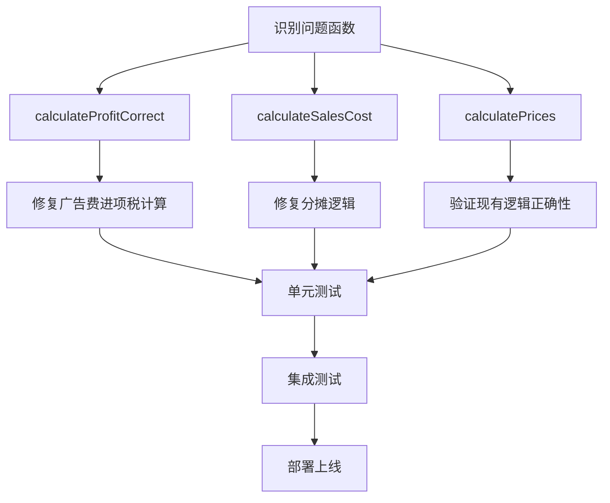

# 利润计算广告费进项税抵扣口径修复设计文档

## 1. 问题背景

### 1.1 问题描述
系统中利润计算主函数存在口径不一致的问题：
- **广告费成本**：使用了 `÷E`（有效销售率）的退货摊销口径，按"每个有效成交"分摊
- **广告费进项税抵扣**：没有使用相同的 `÷E` 口径，直接基于全额广告费计算

这种不一致导致了计算错误，违反了成本确认与税务抵扣应保持同一口径的会计原则。

### 1.2 影响范围
影响所有涉及利润计算的核心函数：
- `calculateProfitCorrect()` - 主要利润计算函数
- `calculateSalesCost()` - 销售成本计算函数  
- `calculatePrices()` - 价格计算函数
- 其他调用这些函数的业务模块

## 2. 技术分析

### 2.1 当前错误实现

```javascript
// 广告费成本（正确）- 按有效成交分摊
const adCost = (sellingPrice * adRate) / E;

// 广告费进项税（错误）- 未按相同口径分摊  
const inputVAT_ad = (sellingPrice * adRate) * (SERVICE_VAT / (1 + SERVICE_VAT));
```

### 2.2 修复原则
任何被用 `÷E` 摊到"每个有效成交"的支出，其对应的可抵扣进项税额也要用同一口径摊到"每个有效成交"。

具体规则：
- **广告费**：发货时产生，可能因退货无法收回 → 需要 `÷E` 分摊
- **平台佣金**：只在成交时计提，退货时会退还 → 不需要 `÷E` 分摊

### 2.3 数学验证

以用户提供的测试数据为例：
- 售价：79.8元
- 有效率E：0.88  
- 广告费率：20%
- 平台佣金率：5.5%

**修复前（错误）**：
```
广告费进项税 = (79.8 × 20%) × (6%÷(1+6%)) = 15.96 × 0.0566038 = 0.90元
```

**修复后（正确）**：
```
分摊后广告费 = (79.8 × 20%) ÷ 0.88 = 18.1364元
广告费进项税 = 18.1364 × (6%÷(1+6%)) = 18.1364 × 0.0566038 ≈ 1.0266元
```

修复后利润增加约0.12元，方向正确。

## 3. 修复方案

### 3.1 核心修复

#### 3.1.1 `calculateProfitCorrect` 函数修复

```javascript
// 修复前
const inputVAT_ad = (sellingPrice * adRate) * (SERVICE_VAT / (1 + SERVICE_VAT));

// 修复后  
const inputVAT_ad = adCost * (SERVICE_VAT / (1 + SERVICE_VAT));
```

#### 3.1.2 `calculateSalesCost` 函数修复

```javascript
// 修复前
const adVAT = (adCost / effectiveRate) * VAT_RATE;

// 修复后
const adCostEffective = adCost / effectiveRate; // 分摊后广告费
const adVAT = adCostEffective * (VAT_RATE / (1 + VAT_RATE));
```

#### 3.1.3 `calculatePrices` 函数修复

```javascript  
// 修复前
const adCostEffective = adCost / E;
const adCostNet = adCostEffective / (1 + v);
const adVAT = adCostNet * v;

// 修复后 - 保持现有逻辑，已经是正确的
const adCostEffective = adCost / E; // 分摊后广告费
const adCostNet = adCostEffective / (1 + v); // 不含税广告费
const adVAT = adCostNet * v; // 广告费进项税抵扣
```

### 3.2 验证和测试

#### 3.2.1 单元测试案例

```javascript
// 测试用例：验证口径一致性
const testCase = {
    costPrice: 40,
    sellingPrice: 79.8, 
    adRate: 0.2,
    returnRate: 0.12,
    // ... 其他参数
};

// 预期结果
// 分摊后广告费：18.1364元
// 广告费进项税：1.0266元
// 利润：6.30元（vs 修复前6.18元）
```

#### 3.2.2 回归测试

所有涉及利润计算的功能模块都需要重新验证：
- 利润分析页面
- 商品清单批量计算
- 保本ROI计算
- 数值分析功能

## 4. 实现计划

### 4.1 修复顺序

1. **第一步**：修复 `calculateProfitCorrect` 函数
2. **第二步**：修复 `calculateSalesCost` 函数  
3. **第三步**：验证 `calculatePrices` 函数（已正确，无需修改）
4. **第四步**：全面回归测试

### 4.2 代码修改清单



### 4.3 风险控制

- **向后兼容**：保持函数接口不变，只修改内部实现
- **渐进式修复**：优先修复核心函数，再处理调用方
- **充分测试**：每个修复点都要有对应的测试用例

## 5. 预期效果

### 5.1 计算准确性提升
- 解决进项税抵扣口径不一致问题
- 确保成本确认与税务抵扣逻辑统一
- 提高利润计算的精确度

### 5.2 业务价值
- 用户获得更准确的利润分析结果
- 减少因计算错误导致的定价失误
- 提升系统的专业性和可信度

### 5.3 技术改进
- 消除代码中的逻辑不一致问题
- 为后续功能扩展提供更可靠的基础
- 建立清晰的成本分摊标准

## 6. 后续优化建议

### 6.1 代码重构
- 将成本分摊逻辑抽象为独立函数
- 建立统一的税费计算框架
- 增加更详细的计算过程注释

### 6.2 监控和验证
- 添加计算结果的合理性检查
- 建立自动化测试流程
- 定期进行数据准确性审计

### 6.3 用户体验优化
- 在计算结果中显示详细的成本分解
- 提供计算过程的可视化展示
- 增加口径选择的用户配置选项广告费进项税 = 18.1364 × (6%÷(1+6%)) = 18.1364 × 0.0566038 ≈ 1.0266元
```

修复后利润增加约0.12元，方向正确。

## 3. 修复方案

### 3.1 核心修复

#### 3.1.1 `calculateProfitCorrect` 函数修复

```javascript
// 修复前
const inputVAT_ad = (sellingPrice * adRate) * (SERVICE_VAT / (1 + SERVICE_VAT));

// 修复后  
const inputVAT_ad = adCost * (SERVICE_VAT / (1 + SERVICE_VAT));
```

#### 3.1.2 `calculateSalesCost` 函数修复

```javascript
// 修复前
const adVAT = (adCost / effectiveRate) * VAT_RATE;

// 修复后
const adCostEffective = adCost / effectiveRate; // 分摊后广告费
const adVAT = adCostEffective * (VAT_RATE / (1 + VAT_RATE));
```

#### 3.1.3 `calculatePrices` 函数修复

```javascript  
// 修复前
const adCostEffective = adCost / E;
const adCostNet = adCostEffective / (1 + v);
const adVAT = adCostNet * v;

// 修复后 - 保持现有逻辑，已经是正确的
const adCostEffective = adCost / E; // 分摊后广告费
const adCostNet = adCostEffective / (1 + v); // 不含税广告费
const adVAT = adCostNet * v; // 广告费进项税抵扣
```

### 3.2 验证和测试

#### 3.2.1 单元测试案例

```javascript
// 测试用例：验证口径一致性
const testCase = {
    costPrice: 40,
    sellingPrice: 79.8, 
    adRate: 0.2,
    returnRate: 0.12,
    // ... 其他参数
};

// 预期结果
// 分摊后广告费：18.1364元
// 广告费进项税：1.0266元
// 利润：6.30元（vs 修复前6.18元）
```

#### 3.2.2 回归测试

所有涉及利润计算的功能模块都需要重新验证：
- 利润分析页面
- 商品清单批量计算
- 保本ROI计算
- 数值分析功能

## 4. 实现计划

### 4.1 修复顺序

1. **第一步**：修复 `calculateProfitCorrect` 函数
2. **第二步**：修复 `calculateSalesCost` 函数  
3. **第三步**：验证 `calculatePrices` 函数（已正确，无需修改）
4. **第四步**：全面回归测试

### 4.2 代码修改清单


### 4.3 风险控制

- **向后兼容**：保持函数接口不变，只修改内部实现
- **渐进式修复**：优先修复核心函数，再处理调用方
- **充分测试**：每个修复点都要有对应的测试用例

## 5. 预期效果

### 5.1 计算准确性提升
- 解决进项税抵扣口径不一致问题
- 确保成本确认与税务抵扣逻辑统一
- 提高利润计算的精确度

### 5.2 业务价值
- 用户获得更准确的利润分析结果
- 减少因计算错误导致的定价失误
- 提升系统的专业性和可信度

### 5.3 技术改进
- 消除代码中的逻辑不一致问题
- 为后续功能扩展提供更可靠的基础
- 建立清晰的成本分摊标准

## 6. 后续优化建议

### 6.1 代码重构
- 将成本分摊逻辑抽象为独立函数
- 建立统一的税费计算框架
- 增加更详细的计算过程注释

### 6.2 监控和验证
- 添加计算结果的合理性检查
- 建立自动化测试流程
- 定期进行数据准确性审计

### 6.3 用户体验优化
- 在计算结果中显示详细的成本分解
- 提供计算过程的可视化展示
- 增加口径选择的用户配置选项


