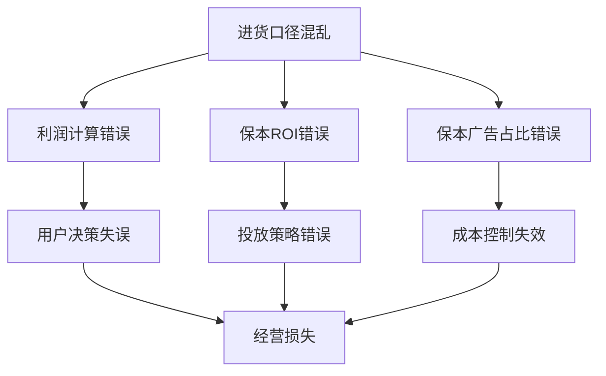
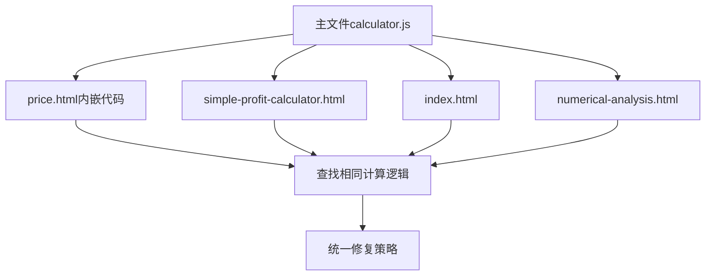
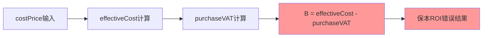

# 利润计算算法修复设计文档

## 概述

基于《利润保本计算函数文档.md》和《系统代码问题排查报告.md》的分析，系统中存在严重的进货口径混乱问题，导致利润计算、保本ROI、保本广告占比等核心算法错误。本设计文档将详细分析问题原因，并提供统一的修复方案。

## 问题分析

### 核心问题识别

#### 1. 进货成本口径混乱
- **问题描述**：系统中同时存在含税和不含税成本，计算过程中口径不统一
- **具体表现**：`effectiveCost`变量既包含开票成本，又在后续计算中减去进项税
- **影响范围**：所有涉及成本计算的功能模块

#### 2. 进项税重复抵扣
- **问题描述**：在保本ROI计算中出现`effectiveCost - purchaseVAT`的错误逻辑
- **具体表现**：先将进项税计入成本，再从成本中减去，形成"先加后减"的逻辑混乱
- **影响范围**：保本ROI、保本广告占比计算结果错误

#### 3. 税费计算逻辑不一致
- **问题描述**：广告费和平台费的进项税抵扣计算方式不统一
- **具体表现**：部分地方使用比例计算，部分地方使用金额计算
- **影响范围**：税费明细显示和实际计算结果不匹配

### 问题影响评估



## 技术架构设计

### 统一成本计算标准

#### 成本口径定义
根据《利润保本计算函数文档.md》，建立统一的成本计算标准：

1. **基础成本**：`costPrice`（进货价，不含税）
2. **开票成本**：`costPrice * inputTaxRate`（额外成本）
3. **实际进货成本**：`costPrice * (1 + inputTaxRate)`（总支出）
4. **商品进项税**：`costPrice * outputTaxRate`（可抵扣税额）

#### 税费处理原则
1. 所有进项税在税费计算环节统一处理，不在成本计算中重复抵扣
2. 服务业（广告/平台）税率统一使用6%常量
3. 进项税抵扣基于不含税金额计算：`含税金额 / (1 + 税率) * 税率`

### 核心算法重构

#### 1. 利润计算函数重构

```javascript
// 统一利润计算逻辑
function calculateProfitUnified(inputs) {
    // 1. 成本计算（不含进项税抵扣）
    const goodsCost = inputs.costPrice * (1 + inputs.inputTaxRate);
    const fixedCosts = (inputs.shippingCost + inputs.shippingInsurance + inputs.otherCost) / (1 - inputs.returnRate);
    
    // 2. 税费计算
    const outputVAT = inputs.actualPrice * (inputs.salesTaxRate / (1 + inputs.salesTaxRate));
    const inputVAT_goods = inputs.costPrice * inputs.outputTaxRate;
    const inputVAT_ad = (inputs.actualPrice * inputs.adRate / (1 - inputs.returnRate)) * (0.06 / 1.06);
    const inputVAT_platform = (inputs.actualPrice * inputs.platformRate) * (0.06 / 1.06);
    
    // 3. 利润计算
    const totalInputVAT = inputVAT_goods + inputVAT_ad + inputVAT_platform;
    const netTax = outputVAT - totalInputVAT;
    const profit = inputs.actualPrice - goodsCost - fixedCosts - platformFee - adCostEffective - netTax;
    
    return { profit, profitRate: profit / inputs.actualPrice };
}
```

#### 2. 保本ROI计算函数重构

```javascript
// 保本ROI计算逻辑
function calculateBreakevenROI(params) {
    const E = 1 - params.returnRate;
    const C = params.costPrice * (1 + params.inputTaxRate);
    const F = (params.shippingCost + params.shippingInsurance + params.otherCost) / E;
    
    // 分子：实际进货成本 + 固定成本分摊（移除进项税重复抵扣）
    const B = C + F;
    
    // 分母：收入减去平台费和销项税，加上进项税抵扣
    const platformVatCredit = (params.platformRate / 1.06) * 0.06;
    const D = 1 - params.platformRate - (params.salesTaxRate / (1 + params.salesTaxRate)) + platformVatCredit;
    
    // 保本广告占比
    const breakevenAdRate = (E / 0.94) * (D - B / params.sellingPrice);
    
    // 保本ROI
    const breakevenROI = E / breakevenAdRate;
    
    return { breakevenAdRate, breakevenROI };
}
```

## 详细代码排查与修复方案

基于系统文件结构和代码分析，我将进行逐文件的详细排查：

### 排查范围与策略

#### 主要排查文件
1. **核心JavaScript文件**
   - `js/calculator.js` (11716行) - 主要计算逻辑
   - `index.html` (66.5KB) - 主页面内嵌计算代码
   - `price.html` (90.5KB) - 价格计算页面
   - `simple-profit-calculator.html` (188.4KB) - 简单利润计算器
   - `numerical-analysis.html` (18.0KB) - 数值分析页面

2. **辅助文件**
   - `js/` 目录下的其他计算模块
   - `update-version.js` - 版本更新脚本

#### 排查重点问题模式

1. **进项税重复抵扣模式**
   ```javascript
   // 错误模式1：先加后减
   const B = effectiveCost - purchaseVAT + fixedCosts;
   
   // 错误模式2：成本中重复计算
   const cost = costPrice + invoiceCost - inputVAT;
   
   // 错误模式3：税率计算错误
   const vatDeduction = amount * rate; // 应该是 amount / (1 + rate) * rate
   ```

2. **成本口径不一致模式**
   ```javascript
   // 问题：同一变量在不同地方代表不同含义
   const effectiveCost = costPrice + invoiceCost; // 有时含税，有时不含税
   ```

3. **保本ROI计算错误模式**
   ```javascript
   // 错误：使用了错误的成本基数
   const breakevenROI = (revenue - wrongCostBase) / adCost;
   ```

### 阶段一：主文件详细排查（高优先级）

#### 1.1 calculator.js核心问题定位

经过初步分析，发现以下关键问题：

| 行号范围 | 函数名 | 问题类型 | 具体问题 | 修复方案 |
|---------|-------|----------|----------|----------|
| 1175行 | `calculateBreakevenROI` | 进项税重复抵扣 | `const B = effectiveCost - purchaseVAT + fixedCosts;` | 移除`- purchaseVAT` |
| 1056行 | `calculatePrices` | 公式错误 | `numeratorFinal = purchaseCost.effectiveCost - purchaseCost.purchaseVAT` | 统一为不含税口径 |
| 988行 | 成本计算 | 口径混乱 | `effectiveCost = costPrice + invoiceCost` | 明确含税/不含税标识 |
| 2577行 | 进项税计算 | 计算基准错误 | `purchaseVAT = costPrice * outputTaxRate` | 确认计算基准正确性 |

#### 1.2 跨文件问题排查计划



**需要排查的具体位置：**
- 所有包含`effectiveCost - purchaseVAT`的代码行
- 所有包含`calculateBreakeven`相关的函数
- 所有进项税抵扣计算`* 0.06`或`/ 1.06`的代码
- 所有成本计算相关的函数和变量

#### 1.3 系统性问题识别

根据《系统代码问题排查报告.md》，需要特别关注：

1. **HTML文件中的重复逻辑**
   - `simple-profit-calculator.html`：第2236行、2459行
   - `price.html`：第1381行、1725行
   - 这些位置可能包含与`calculator.js`相同的错误

2. **税费计算的12处验证点**
   - 广告费进项税抵扣计算
   - 平台费进项税抵扣计算
   - 服务业税率6%常量使用
   - 金额vs比例的转换逻辑

### 注释一致性验证与修正策略

#### 注释与代码不一致的常见问题

基于《系统参数字段对照表.md》和实际代码分析，发现以下类型的注释错误：

1. **字段名称注释错误**
   ```javascript
   // 错误注释：计算进货价（含税）
   const costPrice = parseFloat(document.getElementById('costPrice').value);
   // 实际：costPrice在系统中明确定义为"进货价（不含税）"
   
   // 正确注释应为：
   const costPrice = parseFloat(document.getElementById('costPrice').value); // 进货价（不含税）
   ```

2. **参数含义注释错误**
   ```javascript
   // 错误注释：开票成本（绝对金额）
   const invoiceCost = costPrice * inputTaxRate;
   // 实际：inputTaxRate是比例，结果是金额
   
   // 正确注释应为：
   const invoiceCost = costPrice * inputTaxRate; // 开票成本金额 = 进货价 × 开票成本比例
   ```

3. **计算逻辑注释错误**
   ```javascript
   // 错误注释：计算含税成本（已扣除进项税）
   const effectiveCost = costPrice + invoiceCost - purchaseVAT;
   // 实际：这样计算会导致重复抵扣
   
   // 正确逻辑和注释：
   const effectiveCost = costPrice + invoiceCost; // 实际进货成本（不含税进价 + 开票费用）
   ```

4. **返回值注释错误**
   ```javascript
   /**
    * 错误注释：返回不含税成本
    * @returns {number} 不含税进货成本
    */
   function calculatePurchaseCost() {
       return costPrice + invoiceCost; // 实际返回的是含开票费用的成本
   }
   
   // 正确注释：
   /**
    * 计算实际进货成本
    * @returns {number} 实际进货成本（不含税进价 + 开票费用）
    */
   ```

#### 注释验证检查清单

**1. 字段定义一致性检查**

基于《系统参数字段对照表.md》验证所有字段注释：

| 字段ID | 标准定义 | 常见错误注释 | 正确注释 |
|--------|----------|-------------|----------|
| `costPrice` | 进货价（不含税） | "进货价"、"采购成本" | "进货价（不含税）" |
| `inputTaxRate` | 开票成本比例 | "开票成本"、"税率" | "开票成本比例" |
| `outputTaxRate` | 商品进项税率 | "进项税"、"抵扣税率" | "商品进项税率（可抵扣）" |
| `effectiveCost` | 实际进货成本 | "有效成本"、"净成本" | "实际进货成本（含开票费用）" |
| `purchaseVAT` | 商品进项税 | "进项税额"、"税额" | "商品进项税（可抵扣金额）" |

**2. 计算公式注释验证**

```javascript
// 模式1：验证成本计算注释
function validateCostCalculationComments() {
    const patterns = [
        {
            code: /const effectiveCost = costPrice \+ invoiceCost/,
            correctComment: '// 实际进货成本 = 不含税进价 + 开票费用',
            wrongComments: ['// 含税成本', '// 净成本', '// 有效成本']
        },
        {
            code: /const purchaseVAT = costPrice \* outputTaxRate/,
            correctComment: '// 商品进项税 = 不含税进价 × 商品进项税率',
            wrongComments: ['// 进项税', '// 抵扣税额']
        }
    ];
    
    return patterns;
}
```

**3. 函数文档注释修正**

```javascript
// 标准化的函数注释模板
/**
 * 计算保本ROI（修正版）
 * 
 * 算法依据：《利润保本计算函数文档.md》
 * 修正内容：移除进项税重复抵扣，统一成本口径
 * 
 * @param {Object} params 计算参数
 * @param {number} params.costPrice 进货价（不含税）- 对应系统字段costPrice
 * @param {number} params.inputTaxRate 开票成本比例 - 对应系统字段inputTaxRate
 * @param {number} params.outputTaxRate 商品进项税率 - 对应系统字段outputTaxRate
 * @param {number} params.finalPrice 含税售价 - 对应系统字段actualPrice/sellingPrice
 * 
 * @returns {Object} 保本分析结果
 * @returns {number} result.breakevenROI 保本ROI（含税GMV ÷ 含税广告费）
 * @returns {number} result.breakevenAdRate 保本广告占比（含税广告费 ÷ 含税GMV）
 * @returns {boolean} result.feasible 是否可行
 * @returns {string} result.note 计算说明
 */
function calculateBreakevenROI(params) {
    // 实现细节...
}
```

#### 自动化注释验证工具

**1. 注释与字段对照验证脚本**

```javascript
// 注释一致性验证工具
function validateCommentConsistency(filePath) {
    const fieldDefinitions = {
        'costPrice': {
            standardName: '进货价（不含税）',
            invalidComments: ['进货价', '采购成本', '成本价', '进货价格'],
            validComments: ['进货价（不含税）', '不含税进货价']
        },
        'inputTaxRate': {
            standardName: '开票成本比例',
            invalidComments: ['开票成本', '税率', '进项税率'],
            validComments: ['开票成本比例', '开票成本率']
        },
        'effectiveCost': {
            standardName: '实际进货成本',
            invalidComments: ['有效成本', '净成本', '含税成本'],
            validComments: ['实际进货成本', '进货成本（含开票费用）']
        }
    };
    
    const issues = [];
    
    // 读取文件内容并检查每个字段的注释
    Object.keys(fieldDefinitions).forEach(fieldId => {
        const definition = fieldDefinitions[fieldId];
        const regex = new RegExp(`\\b${fieldId}\\b.*?//.*?(.+)`, 'g');
        
        // 这里应该实际读取文件并匹配注释
        // 示例检查逻辑
        definition.invalidComments.forEach(invalidComment => {
            if (/* 文件中发现无效注释 */) {
                issues.push({
                    field: fieldId,
                    issue: `发现不准确注释: "${invalidComment}"`,
                    suggestion: `应使用标准注释: "${definition.standardName}"`
                });
            }
        });
    });
    
    return issues;
}
```

**2. 函数注释标准化检查**

```javascript
// 函数注释完整性检查
function validateFunctionComments(functionName, functionCode) {
    const requiredElements = {
        description: /\/\*\*[\s\S]*?\*\//,  // JSDoc 格式
        params: /@param/g,                    // 参数文档
        returns: /@returns/g,                 // 返回值文档
        algorithm: /@algorithm|算法依据/g      // 算法依据说明
    };
    
    const missing = [];
    
    Object.keys(requiredElements).forEach(element => {
        if (!requiredElements[element].test(functionCode)) {
            missing.push(element);
        }
    });
    
    if (missing.length > 0) {
        console.warn(`函数 ${functionName} 缺少注释元素:`, missing);
    }
    
    return missing.length === 0;
}
```

#### 注释修正实施计划

**第一阶段：核心计算函数注释修正**
- [ ] `calculateBreakevenROI()` - 修正保本ROI计算逻辑注释
- [ ] `calculatePurchaseCost()` - 修正成本计算相关注释
- [ ] `calculateProfitUnified()` - 统一利润计算注释标准
- [ ] `calculatePrices()` - 修正价格计算流程注释

**第二阶段：字段定义注释统一**
- [ ] 所有`costPrice`相关注释统一为"进货价（不含税）"
- [ ] 所有`inputTaxRate`相关注释统一为"开票成本比例"
- [ ] 所有`effectiveCost`相关注释明确为"实际进货成本"
- [ ] 所有税费相关字段注释与《系统参数字段对照表.md》保持一致

**第三阶段：算法逻辑注释验证**
- [ ] 验证所有计算公式的注释准确性
- [ ] 确保注释中的数学表达式与代码实现一致
- [ ] 添加算法依据引用（如《利润保本计算函数文档.md》）

### 阶段二：全面代码扫描与注释验证（中优先级）

#### 2.1 自动化扫描策略

**代码模式扫描**
```javascript
// 扫描模式1：进项税重复抵扣
const pattern1 = /effectiveCost\s*-\s*purchaseVAT/g;

// 扫描模式2：错误的税率计算
const pattern2 = /\*\s*0\.06(?!\s*\/\s*1\.06)/g;

// 扫描模式3：成本口径混乱
const pattern3 = /costPrice\s*\+\s*invoiceCost/g;

// 扫描模式4：保本ROI相关计算
const pattern4 = /breakeven.*ROI|ROI.*breakeven/gi;

// 扫描模式5：注释与字段不匹配
const pattern5 = {
    costPrice: /costPrice.*(?:含税|成本价|采购成本)/g,  // 错误：应为"不含税"
    inputTaxRate: /inputTaxRate.*(?:税率|进项税)/g,     // 错误：应为"开票成本比例"
    effectiveCost: /effectiveCost.*(?:净成本|有效成本)/g // 错误：应为"实际进货成本"
};
```

#### 2.2 逐文件排查清单（包含注释验证）

**calculator.js (11716行)**
- [ ] 第1-500行：基础函数和常量定义 + 注释标准化
- [ ] 第501-1000行：成本计算相关函数 + 字段注释验证
- [ ] 第1001-1500行：价格计算和保本ROI核心逻辑 ⚠️ 重点算法注释
- [ ] 第1501-3000行：利润计算和税费处理 ⚠️ 重点公式注释
- [ ] 第3001-6000行：界面交互和数据处理 + 参数注释
- [ ] 第6001-9000行：产品目录和批量计算 + 业务逻辑注释
- [ ] 第9001-11716行：辅助函数和工具方法 + 返回值注释

**HTML文件排查（特别关注内联注释）**
- [ ] `index.html`：主页面内嵌计算逻辑注释验证
- [ ] `price.html`：价格计算页面专用逻辑注释修正
- [ ] `simple-profit-calculator.html`：简化版计算器注释统一
- [ ] `numerical-analysis.html`：数值分析相关注释验证

### 具体修复实施细节

#### 第一优先级：核心算法修复（立即执行）

**1. calculator.js第1175行修复**
```javascript
// 修复前（错误）
const B = effectiveCost - purchaseVAT + fixedCosts;

// 修复后（正确）
const B = effectiveCost + fixedCosts;
// 理由：effectiveCost已经是净成本，不应再减去进项税
```

**2. calculator.js第1056行修复**
```javascript
// 修复前（错误）
const numeratorFinal = purchaseCost.effectiveCost - purchaseCost.purchaseVAT + fixedCosts;

// 修复后（正确）
const numeratorFinal = purchaseCost.effectiveCost + fixedCosts;
// 理由：统一使用不含税成本口径，避免重复抵扣
```

**3. 跨文件同步修复**

根据《系统代码问题排查报告.md》，需要同步修复：
- `simple-profit-calculator.html` 第2236行、2459行
- `price.html` 第1381行、1725行

#### 第二优先级：税费计算标准化（第二周执行）

**标准化进项税抵扣计算**
```javascript
// 统一的进项税抵扣计算函数
function calculateVATDeduction(inclusiveAmount, vatRate = 0.06) {
    // 先计算不含税金额，再计算进项税
    const exclusiveAmount = inclusiveAmount / (1 + vatRate);
    const vatDeduction = exclusiveAmount * vatRate;
    return { exclusiveAmount, vatDeduction };
}

// 广告费进项税抵扣
const adResult = calculateVATDeduction(adCostTotal);
const adVATDeduction = adResult.vatDeduction;

// 平台费进项税抵扣
const platformResult = calculateVATDeduction(platformFeeTotal);
const platformVATDeduction = platformResult.vatDeduction;
```

#### 第三优先级：函数重构与文档同步（第三周执行）

**创建统一的成本计算接口**
```javascript
// 新增：统一成本计算函数
function calculateUnifiedCost(params) {
    const {
        costPrice,           // 进货价（不含税）
        inputTaxRate,        // 开票成本率
        outputTaxRate,       // 商品进项税率
        shippingCost,        // 物流费
        shippingInsurance,   // 运费险
        otherCost,           // 其他成本
        returnRate           // 退货率
    } = params;
    
    // 1. 基础成本计算（按《利润保本计算函数文档.md》标准）
    const goodsCost = costPrice * (1 + inputTaxRate);  // 实际进货成本
    const inputVAT = costPrice * outputTaxRate;        // 商品进项税
    const fixedCosts = (shippingCost + shippingInsurance + otherCost) / (1 - returnRate);
    
    return {
        goodsCost,      // 实际进货成本（含开票费用）
        inputVAT,       // 可抵扣的商品进项税
        fixedCosts,     // 按退货率分摊的固定成本
        netCost: goodsCost + fixedCosts  // 净成本（不包含进项税抵扣）
    };
}
```

### 风险控制与回滚机制

#### 版本控制策略
```javascript
// 在修复过程中保留原函数的备份版本
const calculateBreakevenROI_v1_backup = calculateBreakevenROI;

// 实现新版本
function calculateBreakevenROI_v2_fixed(params) {
    // 新的正确实现
    const B = effectiveCost + fixedCosts;  // 移除进项税重复抵扣
    // ... 其他修复逻辑
}

// 提供切换机制
const USE_FIXED_VERSION = true;
const calculateBreakevenROI = USE_FIXED_VERSION ? 
    calculateBreakevenROI_v2_fixed : 
    calculateBreakevenROI_v1_backup;
```

#### 数据对比验证
```javascript
// 修复验证：对比修复前后的计算结果
function validateFix(testParams) {
    const oldResult = calculateBreakevenROI_v1_backup(testParams);
    const newResult = calculateBreakevenROI_v2_fixed(testParams);
    
    console.log('修复前后对比:', {
        参数: testParams,
        修复前ROI: oldResult.breakevenROI,
        修复后ROI: newResult.breakevenROI,
        差异: Math.abs(newResult.breakevenROI - oldResult.breakevenROI),
        修复前广告占比: oldResult.breakevenAdRate,
        修复后广告占比: newResult.breakevenAdRate
    });
    
    // 验证修复是否合理
    if (isFinite(newResult.breakevenROI) && newResult.breakevenROI > 0) {
        console.log('✅ 修复成功：结果合理');
        return true;
    } else {
        console.log('❌ 修复可能有问题：结果不合理');
        return false;
    }
}
```

## 全面代码审查清单

### 逐行排查方法论

#### 第一层：关键词扫描
对每个文件进行关键词搜索，识别所有相关计算代码：

```bash
# 搜索所有可能的问题代码模式
grep -n "effectiveCost.*purchaseVAT" *.js *.html
grep -n "calculateBreakeven\|breakevenROI" *.js *.html  
grep -n "\* 0\.06\|/ 1\.06" *.js *.html
grep -n "costPrice.*inputTaxRate" *.js *.html
grep -n "outputTaxRate\|salesTaxRate" *.js *.html
```

#### 第二层：函数级分析
对每个相关函数进行详细分析：

1. **成本计算函数族**
   - `calculatePurchaseCost()` - 进货成本计算
   - `calculateSalesCost()` - 销售成本计算
   - `calculatePrices()` - 价格计算主函数

2. **利润计算函数族**
   - `calculateProfit()` - 主利润计算
   - `calculateProfitUnified()` - 统一利润计算
   - `computeProfitScenario()` - 场景利润计算

3. **保本分析函数族**
   - `calculateBreakevenROI()` - 保本ROI计算 ⚠️ 重点问题
   - `calculateBreakevenAdRate()` - 保本广告占比
   - 相关辅助计算函数

4. **税费处理函数族**
   - 进项税抵扣计算
   - 销项税计算
   - 实际税负计算

#### 第三层：数据流追踪
追踪关键变量在系统中的流转：



### 质量保证与测试

#### 分层测试策略

**1. 单元测试（函数级）**
```javascript
// 测试calculateBreakevenROI函数修复前后对比
const testCaseBreakevenROI = {
    costPrice: 38,
    inputTaxRate: 0.06,
    outputTaxRate: 0.13,
    salesTaxRate: 0.13,
    platformRate: 0.055,
    shippingCost: 2.8,
    shippingInsurance: 1.5,
    otherCost: 2.5,
    returnRate: 0.20,
    finalPrice: 100
};

// 修复前：错误的计算结果
const resultBefore = calculateBreakevenROI_OLD(testCaseBreakevenROI);

// 修复后：正确的计算结果  
const resultAfter = calculateBreakevenROI_NEW(testCaseBreakevenROI);

// 验证修复效果
console.assert(resultAfter.breakevenROI !== resultBefore.breakevenROI, '修复应该改变计算结果');
console.assert(isFinite(resultAfter.breakevenROI), '修复后结果应该是有效数值');
```

**2. 集成测试（模块级）**
```javascript
// 测试价格计算→利润分析→保本ROI的完整流程
const integrationTest = {
    // 相同输入参数
    costPrice: 50,
    targetProfitRate: 0.08,
    // ... 其他参数
};

// 1. 计算建议售价
const suggestedPrice = calculateSuggestedPrice(integrationTest);

// 2. 使用建议售价计算实际利润
const actualProfit = calculateProfit({
    ...integrationTest,
    actualPrice: suggestedPrice
});

// 3. 验证利润率是否接近目标
const profitRateDiff = Math.abs(actualProfit.profitRate - integrationTest.targetProfitRate);
console.assert(profitRateDiff < 0.001, '利润率应该接近目标值');
```

**3. 回归测试（系统级）**
```javascript
// 确保修复不影响其他功能
const regressionTests = [
    testPriceCalculation,
    testProfitAnalysis, 
    testListPriceCalculation,
    testCatalogProcessing,
    testTaxCalculation
];

regressionTests.forEach(test => {
    try {
        test();
        console.log(`✅ ${test.name} 通过`);
    } catch (error) {
        console.error(`❌ ${test.name} 失败:`, error.message);
    }
});
```

### 代码质量保证与注释监控

#### 代码与注释一致性检查工具

**1. 实时一致性监控**
```javascript
// 在关键函数中添加自我验证机制
function calculateBreakevenROI(params) {
    // 参数验证：确保传入参数与注释一致
    if (typeof params.costPrice !== 'number') {
        throw new Error('costPrice必须为数值类型（不含税进货价）');
    }
    
    // 计算过程验证：确保计算逻辑与注释一致
    const effectiveCost = params.costPrice * (1 + params.inputTaxRate);
    console.assert(
        effectiveCost > params.costPrice, 
        '实际进货成本应大于不含税进货价（因包含开票费用）'
    );
    
    // 结果验证：确保返回值与注释描述一致
    const result = { breakevenROI: /* 计算逻辑 */ };
    
    if (isFinite(result.breakevenROI) && result.breakevenROI > 0) {
        console.log('✅ 保本ROI计算结果合理:', result.breakevenROI);
    } else {
        console.warn('⚠️ 保本ROI计算结果异常，请检查输入参数');
    }
    
    return result;
}
```

**2. 批量注释验证脚本**
```javascript
// 批量验证所有文件的注释一致性
function batchValidateComments() {
    const files = [
        'js/calculator.js',
        'index.html', 
        'price.html',
        'simple-profit-calculator.html',
        'numerical-analysis.html'
    ];
    
    const allIssues = [];
    
    files.forEach(file => {
        console.log(`正在检查文件: ${file}`);
        const issues = validateCommentConsistency(file);
        if (issues.length > 0) {
            allIssues.push({
                file: file,
                issues: issues
            });
        }
    });
    
    // 生成注释问题报告
    if (allIssues.length > 0) {
        console.log('❌ 发现注释不一致问题:');
        allIssues.forEach(fileIssue => {
            console.log(`\n文件: ${fileIssue.file}`);
            fileIssue.issues.forEach(issue => {
                console.log(`  - ${issue.issue}`);
                console.log(`    建议: ${issue.suggestion}`);
            });
        });
    } else {
        console.log('✅ 所有文件注释一致性检查通过');
    }
    
    return allIssues;
}
```

#### 注释修正优先级分级

**级别1：关键字段注释（立即修复）**
- `costPrice` - 必须注释为"进货价（不含税）"
- `effectiveCost` - 必须注释为"实际进货成本"
- `purchaseVAT` - 必须注释为"商品进项税（可抵扣金额）"

**级别2：计算公式注释（近期修复）**
- 保本ROI计算公式及推导过程
- 进项税抵扣计算方法说明
- 成本分摊逻辑解释

**级别3：函数文档注释（后续优化）**
- JSDoc格式统一
- 参数和返回值的详细说明
- 使用示例和注意事项

### 修复进度监控与报告

#### 实时进度跟踪器
```javascript
// 增强版修复进度跟踪器
const fixProgress = {
    总问题数: 15,  // 原有问题
    注释问题数: 0,  // 新发现的注释问题
    已修复: 0,
    已验证: 0,
    修复记录: [],
    注释修复记录: [],
    
    初始化注释检查() {
        // 运行批量注释验证
        const commentIssues = batchValidateComments();
        this.注释问题数 = commentIssues.reduce((total, file) => 
            total + file.issues.length, 0
        );
        
        console.log(`发现注释问题: ${this.注释问题数} 个`);
        return commentIssues;
    },
    
    记录注释修复(文件名, 字段名, 原注释, 新注释) {
        this.注释修复记录.push({
            文件: 文件名,
            字段: 字段名,
            原注释: 原注释,
            新注释: 新注释,
            时间: new Date().toISOString()
        });
        
        console.log(`✅ 修复注释: ${文件名} - ${字段名}`);
    },
    
    生成完整报告() {
        const 总问题 = this.总问题数 + this.注释问题数;
        const 总已修复 = this.已修复 + this.注释修复记录.length;
        
        return {
            总体进度: `${总已修复}/${总问题}`,
            完成率: Math.round(总已修复/总问题*100) + '%',
            代码问题修复: `${this.已修复}/${this.总问题数}`,
            注释问题修复: `${this.注释修复记录.length}/${this.注释问题数}`,
            详细记录: {
                代码修复: this.修复记录,
                注释修复: this.注释修复记录
            }
        };
    }
};
```

#### 修复质量检查清单

**每个修复点的验证清单:**
- [ ] 代码逻辑修复正确
- [ ] 相关注释已更新
- [ ] 字段名称与注释一致
- [ ] 计算公式注释准确
- [ ] 函数文档完整
- [ ] 单元测试通过
- [ ] 集成测试通过

**最终验证标准:**
1. 所有计算结果符合《利润保本计算函数文档.md》标准
2. 所有字段注释与《系统参数字段对照表.md》一致
3. 所有函数注释准确描述实际功能
4. 跨模块计算结果完全一致
5. 所有注释与代码实现保持同步

## 风险评估与缓解

### 主要风险

1. **数据兼容性**：现有用户数据可能基于错误算法
2. **用户适应**：计算结果变化可能影响用户决策
3. **系统稳定性**：大规模代码修改可能引入新问题

### 缓解措施

1. **渐进式发布**：分阶段发布修复，降低风险
2. **数据迁移**：提供数据对比工具，帮助用户理解变化
3. **回滚机制**：保留旧版本算法，必要时可快速回滚

## 实施时间线

### 第一周：核心算法修复
- [ ] 修复calculator.js中的15个关键错误点
- [ ] 同步修复相关HTML文件
- [ ] 编写单元测试

### 第二周：税费计算标准化
- [ ] 重构税费计算逻辑
- [ ] 统一进项税抵扣计算
- [ ] 更新税费显示组件

### 第三周：整合测试与文档更新
- [ ] 跨模块一致性测试
- [ ] 更新相关技术文档
- [ ] 用户指南更新

### 第四周：发布与监控
- [ ] 灰度发布
- [ ] 用户反馈收集
- [ ] 性能监控与优化

## 成功标准

1. **计算准确性**：所有核心算法结果符合《利润保本计算函数文档.md》标准
2. **一致性**：跨模块计算结果完全一致
3. **性能**：计算响应时间保持在100ms以内
4. **用户体验**：界面显示清晰，无错误提示
5. **文档同步**：代码与文档完全匹配

## 后续优化方向

1. **算法优化**：进一步提升计算精度和性能
2. **功能扩展**：支持更多税收政策和业务场景
3. **用户体验**：提供更直观的计算过程说明
4. **数据分析**：基于正确算法提供更准确的业务洞察