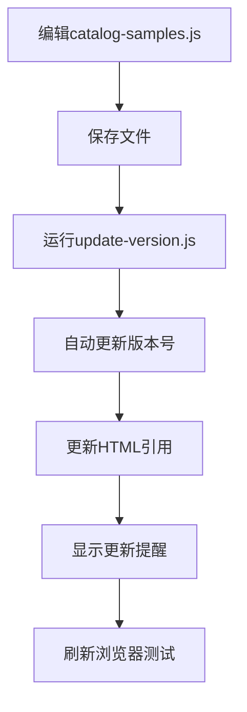

# 示例文件版本号管理说明

## 概述

本项目已实现自动化的示例文件版本号管理，确保每次更新示例数据后，浏览器能够正确加载最新内容，避免缓存问题。

## 文件结构

```
price-calculator/
├── js/
│   └── catalog-samples.js          # 示例数据文件（包含版本号）
├── index.html                      # 主页面（引用带版本号的JS文件）
├── update-version.js               # 自动版本号更新脚本
└── VERSION_UPDATE_README.md        # 本文档
```

## 使用方法

### 1. 更新示例数据

当需要添加、修改或删除示例数据时：

1. 编辑 `js/catalog-samples.js` 文件
2. 保存更改
3. 运行版本号更新脚本

### 2. 自动更新版本号

```bash
# 基本用法
node update-version.js [新版本号]

# 示例
node update-version.js 1.0.2
node update-version.js 2.0.0
node update-version.js 1.1.5
```

### 3. 版本号格式规范

版本号必须遵循语义化版本规范：`主版本.次版本.修订版本`

- **主版本**：不兼容的API修改
- **次版本**：向下兼容的功能性新增
- **修订版本**：向下兼容的问题修正

**示例**：
- `1.0.1` - 添加新示例数据
- `1.1.0` - 新增功能字段
- `2.0.0` - 重大结构变更

## 工作流程

### 更新示例数据流程



### 脚本执行过程

1. **验证版本号格式**
2. **更新catalog-samples.js中的版本号**
3. **更新index.html中的script引用**
4. **显示更新完成提醒**
5. **提供下次更新指导**

## 文件变更说明

### catalog-samples.js 变更

```javascript
// 版本号：v1.0.1 (2024-12-01)  ← 自动更新
// 说明：...

// 版本历史：                    ← 自动维护
// v1.0.2 (2024-12-02) - 更新示例数据
// v1.0.1 (2024-12-01) - 新增25条示例数据
// v1.0.0 (初始版本) - 基础示例数据
```

### index.html 变更

```html
<!-- 自动更新版本号 -->
<script src="js/catalog-samples.js?v=1.0.2"></script>
```

## 常见问题

### Q: 为什么需要版本号？
A: 浏览器会缓存JavaScript文件，添加版本号可以强制浏览器重新加载最新文件，确保示例数据及时更新。

### Q: 忘记更新版本号怎么办？
A: 运行 `node update-version.js 新版本号` 即可自动更新所有相关文件。

### Q: 版本号可以重复使用吗？
A: 不建议重复使用，每次更新都应该使用新的版本号，便于追踪变更历史。

### Q: 脚本执行失败怎么办？
A: 检查文件权限、路径是否正确，确保Node.js环境正常。

## 最佳实践

### 1. 版本号命名建议
- 小功能更新：`1.0.1`, `1.0.2`, `1.0.3`
- 功能增强：`1.1.0`, `1.2.0`
- 重大更新：`2.0.0`, `3.0.0`

### 2. 更新频率
- 每次修改示例数据后立即更新版本号
- 避免累积多次更改后一次性更新
- 保持版本号与变更内容的对应关系

### 3. 测试验证
- 更新版本号后刷新浏览器页面
- 测试"插入示例"功能是否正常
- 确认新数据能够正确显示

## 技术实现

### 核心功能
- **文件内容解析**：使用正则表达式匹配和替换
- **版本号验证**：确保版本号格式正确
- **自动日期更新**：使用当前日期作为更新标记
- **错误处理**：提供详细的错误信息和解决建议

### 依赖要求
- Node.js环境（内置fs、path模块）
- 文件读写权限
- 正确的文件路径结构

## 维护说明

### 定期检查
- 确保版本号格式正确
- 验证HTML引用是否同步
- 检查版本历史记录完整性

### 备份建议
- 更新前备份重要文件
- 使用版本控制系统（如Git）
- 记录重要的变更内容

---

**最后更新**：2024-12-01  
**当前版本**：v1.0.1  
**维护状态**：活跃维护中
